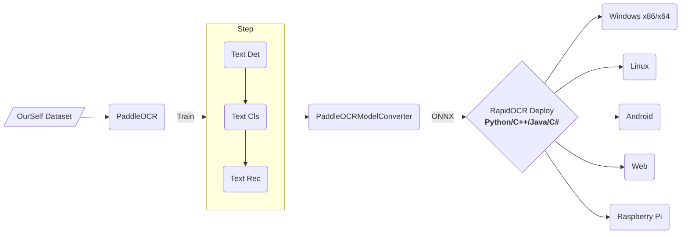

  

# 捷智OCR
*信创级开源OCR - 为世界内容安全贡献力量*

    
    
    
     
    <a href="">=3.6,<3.12-aff.svg"></a>
    
    
    
    
    
    
    
    

## 商业支持
- 🎉🎉🎉 推出知识星球[RapidAI私享群](https://t.zsxq.com/0duLBZczw)，这里的提问会优先得到回答和支持，也会享受到RapidAI组织后续持续优质的服务，欢迎大家的加入。
- 提供信创平台多架构，包括**Arm/X86/mips(龙芯)/RISC-V**等信创CPU支持，同时兼容**ONNXRuntime/OpenVINO/NCNN**。有意者邮件联系: znsoft@163.com, 请先邮件咨询服务项目，即时回复联系方式。
- 提供国产操作系统（海光、中科方德、麒麟等等）OCR Docker部署服务，有意者 → ✉ liekkaskono@163.com。

## 简介
- 💖目前已知**运行速度最快、支持最广**，完全开源免费并支持离线快速部署的多平台多语言OCR。
- **支持的语言**: 默认是中英文，其他语言识别需要自助转换。具体参考[这里](https://github.com/RapidAI/RapidOCR/wiki/support_language)
- **缘起**：百度paddlepaddle工程化不是太好，为了方便大家在各种端上进行ocr推理，我们将它转换为onnx格式，使用`Python/C++/Java/Swift/C#` 将它移植到各个平台。
- **名称来源**： 轻快好省并智能。基于深度学习技术的OCR技术，主打人工智能优势及小模型，以速度为使命，效果为主导。
- **使用**：
  - 如果仓库下已有模型满足要求 → RapidOCR部署使用即可。
  - 不满足要求 → 基于[PaddleOCR](https://github.com/PaddlePaddle/PaddleOCR)在自己数据上微调 → RapidOCR部署。
- 如果该仓库有帮助到你，还请点个小星星⭐呗！

## 生态框架

