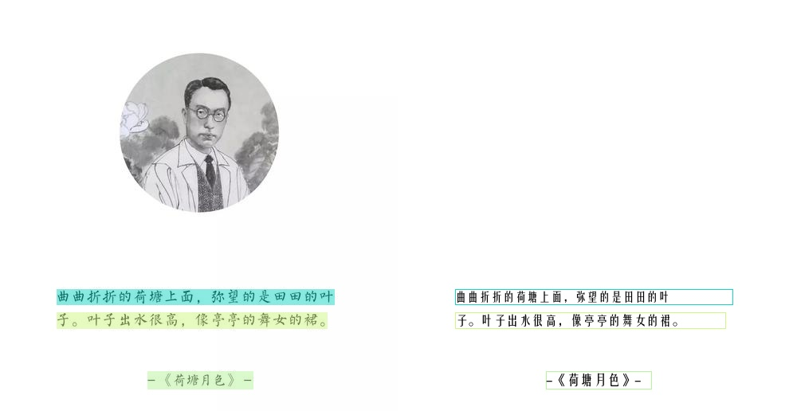

> 该文章主要记录RapidOCR如何集成PP-OCRv4_server_rec_doc模型的，涉及模型转换，模型精度测试等步骤。

<!-- more -->

### 引言

来自PaddleX[官方文档](https://paddlepaddle.github.io/PaddleX/latest/module_usage/tutorials/ocr_modules/text_recognition.html#_2)：

> PP-OCRv4_server_rec_doc是在PP-OCRv4_server_rec的基础上，在更多中文文档数据和PP-OCR训练数据的混合数据训练而成，增加了部分繁体字、日文、特殊字符的识别能力，可支持识别的字符为1.5万+，除文档相关的文字识别能力提升外，也同时提升了通用文字的识别能力。

来自[MinerU](https://github.com/opendatalab/MinerU/blob/master/README_zh-CN.md)的官方测试，对该模型的评价：

> 经验证，PP-OCRv4_server_rec_doc模型在中英日繁单种语言或多种语言混合场景均有明显精度提升，且速度与PP-OCRv4_server_rec相当，适合绝大部分场景使用。
>
> PP-OCRv4_server_rec_doc在小部分纯英文场景可能会发生单词粘连问题，PP-OCRv4_server_rec则在此场景下表现更好。

综上所述，该模型在各个场景下均有明显精度提升，尤其是生僻字和一些特殊符号。值得说明的是该模型为server版，因此推理速度不是那么快。

### 以下代码运行环境

- OS: macOS Sequois 15.4.1
- Python: 3.10.14
- PaddlePaddle: 3.0.0
- paddle2onnx: 2.0.1
- rapidocr: 2.0.7

### 1. 模型跑通

该步骤主要先基于PaddleX可以正确使用PP-OCRv4_server_rec_doc模型得到正确结果。

该部分主要参考文档：[docs](https://paddlepaddle.github.io/PaddleX/latest/module_usage/tutorials/ocr_modules/text_recognition.html#_3)

安装`paddlex`:

```bash linenums="1"
pip install "paddlex[ocr]==3.0.0rc1"
```

测试PP-OCRv4_server_rec_doc模型能否正常识别：

测试用图：


!!! tip

    运行以下代码时，模型会自动下载到**/Users/用户名/.paddlex/official_models**下。

```python linenums="1"
from paddlex import create_model

model = create_model(model_name="PP-OCRv4_server_rec_doc")
output = model.predict(input="images/1.jpg", batch_size=1)
for res in output:
    res.print()
    res.save_to_img(save_path="./output/")
    res.save_to_json(save_path="./output/res.json")

# 输出以下内容，表明成功：
# {'res': {'input_path': 'images/1.jpg', 'page_index': None, 'rec_text': '绿洲仕格维花园公寓', 'rec_score': 0.9839767813682556}}
```

### 2. 模型转换

该部分主要参考文档： [docs](https://paddlepaddle.github.io/PaddleX/latest/pipeline_deploy/paddle2onnx.html?h=paddle2onnx#22)

PaddleX官方集成了paddle2onnx的转换代码：

```bash linenums="1"
paddlex --paddle2onnx --paddle_model_dir models/PP-OCRv4_server_rec_doc --onnx_model_dir models/PP-OCRv4_server_rec_doc
```

输出日志如下，表明成功：

```bash linenums="1"
Input dir: models/PP-OCRv4_server_rec_doc
Output dir: models/PP-OCRv4_server_rec_doc
Paddle2ONNX conversion starting...
  warnings.warn(warning_message)
[Paddle2ONNX] Start parsing the Paddle model file...
[Paddle2ONNX] Use opset_version = 7 for ONNX export.
[Paddle2ONNX] PaddlePaddle model is exported as ONNX format now.
2025-05-14 08:21:23 [INFO]      Try to perform optimization on the ONNX model with onnxoptimizer.
2025-05-14 08:21:23 [INFO]      ONNX model saved in models/PP-OCRv4_server_rec_doc/inference.onnx.
Paddle2ONNX conversion succeeded
Done
```

### 3. 模型推理验证

该部分主要是在RapidOCR项目中测试能否直接使用onnx模型。要点主要是确定模型前后处理是否兼容。从PaddleX[官方文档](https://paddlepaddle.github.io/PaddleX/latest/module_usage/tutorials/ocr_modules/text_recognition.html#_2)中可以看到：

> PP-OCRv4_server_rec_doc是在PP-OCRv4_server_rec的基础上，在更多中文文档数据和PP-OCR训练数据的混合数据训练而成，增加了部分繁体字、日文、特殊字符的识别能力，可支持识别的字符为1.5万+，除文档相关的文字识别能力提升外，也同时提升了通用文字的识别能力

以上说明了该模型与PP-OCRv4_server_rec模型结构相同，前后处理也相同。唯一做的就是添加了更多数据，扩展了字典个数，从6623扩展到15630个。

因此，可以直接使用RapidOCR来快速推理验证。代码如下：

```python linenums="1"
from rapidocr import RapidOCR

model_path = "models/PP-OCRv4_server_rec_doc/inference.onnx"
key_path = "models/ppocrv4_doc_dict.txt"
engine = RapidOCR(params={"Rec.model_path": model_path, "Rec.rec_keys_path": key_path})

img_url = "https://img1.baidu.com/it/u=3619974146,1266987475&fm=253&fmt=auto&app=138&f=JPEG?w=500&h=516"
result = engine(img_path)
print(result)

result.vis("vis_result.jpg")
```



### 4. 模型精度测试

该部分主要使用[TextRecMetric](https://github.com/SWHL/TextRecMetric)和测试集[text_rec_test_dataset](https://huggingface.co/datasets/SWHL/text_rec_test_dataset)来评测。

需要注意的是，**PP-OCRv4_server_rec_doc模型更加侧重生僻字和一些符号识别。** 当前测试集并未着重收集生僻字和一些符号的数据，因此以下指标会有些偏低。

如需自己使用，请在自己场景下测试效果。

相关测试步骤请参见[TextRecMetric](https://github.com/SWHL/TextRecMetric)的README，一步一步来就行。我这里测试最终精度如下：

```json
{'ExactMatch': 0.8097, 'CharMatch': 0.9444, 'avg_elapse': 0.0818}
```

### 5. 集成到rapidocr中

该部分主要包括将字典文件写入到ONNX模型中、托管模型到魔搭、更改rapidocr中模型配置文件、编写对应单元测试等。

#### 字典文件写入ONNX模型

该步骤仅存在文本识别模型中，文本检测模型没有这个步骤。

??? info "详细代码"

    ```python linenums="1"
    from pathlib import Path
    from typing import List, Union

    import onnx
    import onnxruntime as ort
    from onnx import ModelProto


    def read_txt(txt_path: Union[Path, str]) -> List[str]:
        with open(txt_path, "r", encoding="utf-8") as f:
            data = [v.rstrip("\n") for v in f]
        return data


    class ONNXMetaOp:
        @classmethod
        def add_meta(
            cls,
            model_path: Union[str, Path],
            key: str,
            value: List[str],
            delimiter: str = "\n",
        ) -> ModelProto:
            model = onnx.load_model(model_path)
            meta = model.metadata_props.add()
            meta.key = key
            meta.value = delimiter.join(value)
            return model

        @classmethod
        def get_meta(
            cls, model_path: Union[str, Path], key: str, split_sym: str = "\n"
        ) -> List[str]:
            sess = ort.InferenceSession(model_path)
            meta_map = sess.get_modelmeta().custom_metadata_map
            key_content = meta_map.get(key)
            key_list = key_content.split(split_sym)
            return key_list

        @classmethod
        def del_meta(cls, model_path: Union[str, Path]) -> ModelProto:
            model = onnx.load_model(model_path)
            del model.metadata_props[:]
            return model

        @classmethod
        def save_model(cls, save_path: Union[str, Path], model: ModelProto):
            onnx.save_model(model, save_path)


    dicts = read_txt(
        "models/ppocrv4_doc_dict.txt"
    )
    model_path = "models/PP-OCRv4_server_rec_doc.onnx"
    model = ONNXMetaOp.add_meta(model_path, key="character", value=dicts)

    new_model_path = "models/PP-OCRv4_server_rec_doc_with_dict.onnx"
    ONNXMetaOp.save_model(new_model_path, model)

    t = ONNXMetaOp.get_meta(new_model_path, key="character")
    print(t)
    ```
