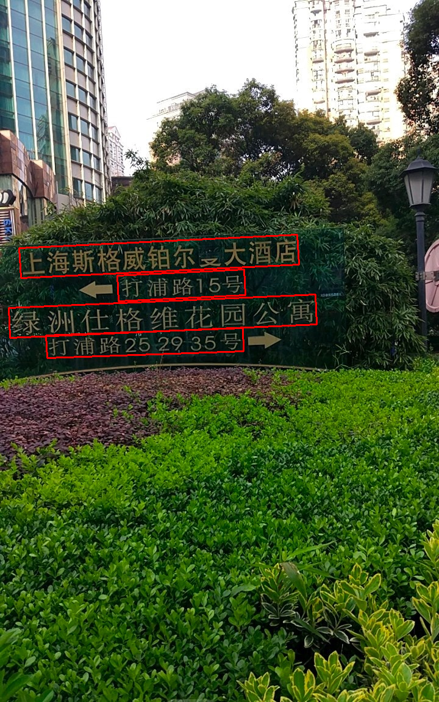
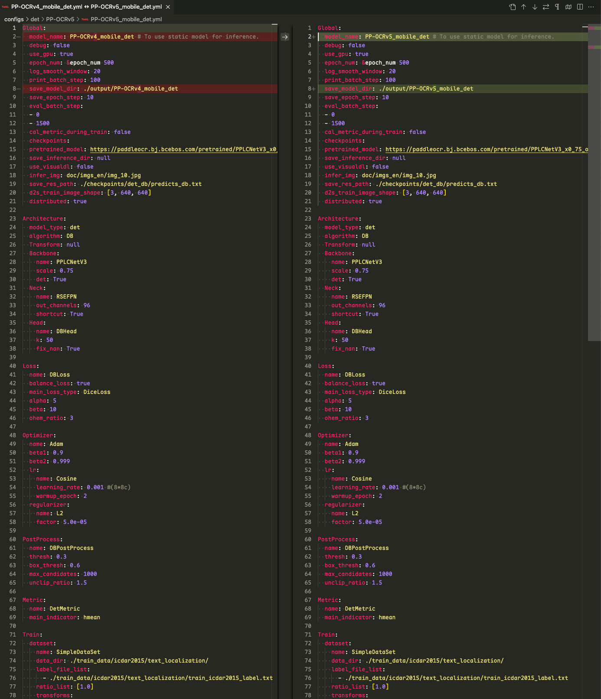
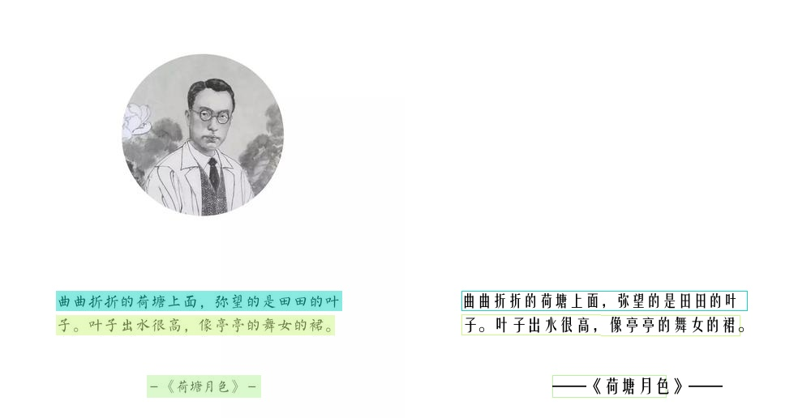
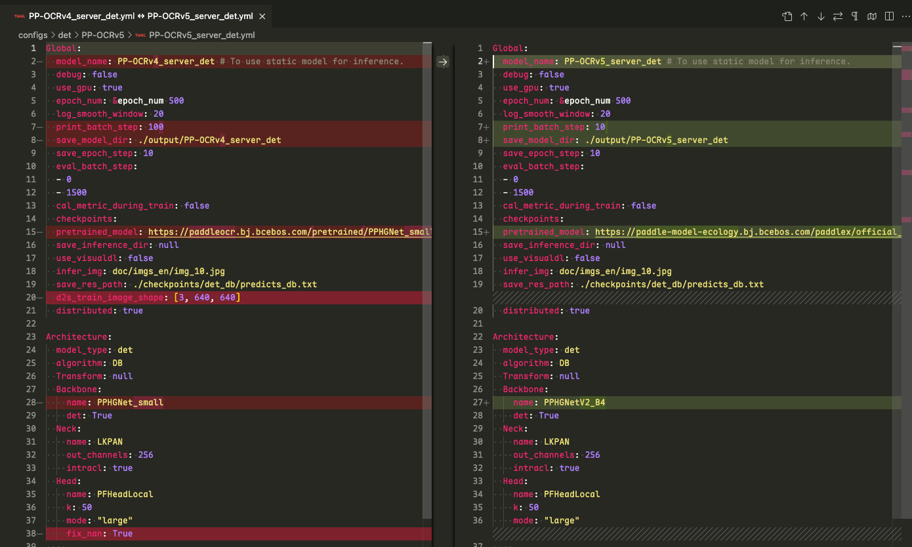

> 该文章主要记录RapidOCR集成PP-OCRv5_mobile_det和PP-OCRv5_server_det模型记录的，涉及模型转换，模型精度测试等步骤。

<!-- more -->

### 引言

### 以下代码运行环境

- OS: macOS Sequoia 15.5
- Python: 3.10.14
- PaddlePaddle: 3.0.0
- paddle2onnx: 2.0.2.rc1
- paddlex: 3.0.0
- rapidocr: 2.1.0

### 1. 模型跑通

该步骤主要先基于PaddleX可以正确使用PP-OCRv5_mobile_det模型得到正确结果。

该部分主要参考文档：[docs](https://paddlepaddle.github.io/PaddleX/latest/module_usage/tutorials/ocr_modules/text_recognition.html#_3)

安装`paddlex`:

```bash linenums="1"
pip install "paddlex[ocr]==3.0.0"
```

测试PP-OCRv5_mobile_det模型能否正常识别：

!!! tip

    运行以下代码时，模型会自动下载到 **/Users/用户名/.paddlex/official_models** 下。

测试图：[link](https://paddle-model-ecology.bj.bcebos.com/paddlex/imgs/demo_image/general_ocr_001.png)

```python linenums="1"

from paddlex import create_model

# mobile
model = create_model(model_name="PP-OCRv5_mobile_det")

# server
model = create_model(model_name="PP-OCRv5_server_det")

output = model.predict(input="images/general_ocr_001.png", batch_size=1)
for res in output:
    res.print()
    res.save_to_img(save_path="./output/")
    res.save_to_json(save_path="./output/res.json")
```

预期结果如下，表明成功运行：



### 2. 模型转换

该部分主要参考文档： [docs](https://paddlepaddle.github.io/PaddleX/latest/pipeline_deploy/paddle2onnx.html?h=paddle2onnx#22)

=== "转换PP-OCRv5_mobile_det"

    PaddleX官方集成了paddle2onnx的转换代码：

    ```bash linenums="1"
    paddlex --install paddle2onnx
    pip install onnx==1.16.0

    paddlex --paddle2onnx --paddle_model_dir models/official_models/PP-OCRv5_mobile_det --onnx_model_dir models/PP-OCRv5_mobile_det
    ```

    输出日志如下，表明转换成功：

    ```bash linenums="1"
    Input dir: models/official_models/PP-OCRv5_mobile_det
    Output dir: models/PP-OCRv5_mobile_det
    Paddle2ONNX conversion starting...
    [Paddle2ONNX] Start parsing the Paddle model file...
    [Paddle2ONNX] Use opset_version = 14 for ONNX export.
    [Paddle2ONNX] PaddlePaddle model is exported as ONNX format now.
    2025-05-26 21:53:00 [INFO]      Try to perform constant folding on the ONNX model with Polygraphy.
    [W] 'colored' module is not installed, will not use colors when logging. To enable colors, please install the 'colored' module: python3 -m pip install colored
    [I] Folding Constants | Pass 1
    [I]     Total Nodes | Original:   925, After Folding:   502 |   423 Nodes Folded
    [I] Folding Constants | Pass 2
    [I]     Total Nodes | Original:   502, After Folding:   502 |     0 Nodes Folded
    2025-05-26 21:53:08 [INFO]      ONNX model saved in models/PP-OCRv5_mobile_det/inference.onnx.
    Paddle2ONNX conversion succeeded
    Copied models/official_models/PP-OCRv5_mobile_det/inference.yml to models/PP-OCRv5_mobile_det/inference.yml
    Done
    ```

=== "转换PP-OCRv5_server_det"

    PaddleX官方集成了paddle2onnx的转换代码：

    ```bash linenums="1"
    paddlex --install paddle2onnx
    pip install onnx==1.16.0

    paddlex --paddle2onnx --paddle_model_dir models/official_models/PP-OCRv5_server_det --onnx_model_dir models/PP-OCRv5_server_det
    ```

    输出日志如下，表明转换成功：

    ```bash linenums="1"
    Input dir: models/official_models/PP-OCRv5_server_det
    Output dir: models/PP-OCRv5_server_det
    Paddle2ONNX conversion starting...
    [Paddle2ONNX] Start parsing the Paddle model file...
    [Paddle2ONNX] Use opset_version = 14 for ONNX export.
    [Paddle2ONNX] PaddlePaddle model is exported as ONNX format now.
    2025-05-26 21:43:10 [INFO]      Try to perform constant folding on the ONNX model with Polygraphy.
    [W] 'colored' module is not installed, will not use colors when logging. To enable colors, please install the 'colored' module: python3 -m pip install colored
    [I] Folding Constants | Pass 1
    [I]     Total Nodes | Original:  1306, After Folding:   596 |   710 Nodes Folded
    [I] Folding Constants | Pass 2
    [I]     Total Nodes | Original:   596, After Folding:   596 |     0 Nodes Folded
    2025-05-26 21:43:21 [INFO]      ONNX model saved in models/PP-OCRv5_server_det/inference.onnx.
    Paddle2ONNX conversion succeeded
    Copied models/official_models/PP-OCRv5_server_det/inference.yml to models/PP-OCRv5_server_det/inference.yml
    Done
    ```

### 3. 模型推理验证

=== "验证PP-OCRv5_mobile_det模型"

    该部分主要是在RapidOCR项目中测试能否直接使用onnx模型。要点主要是确定模型前后处理是否兼容。从PaddleOCR config文件中比较[PP-OCRv4](https://github.com/PaddlePaddle/PaddleOCR/blob/549d83a88b7c75144120e6ec03de80d3eb9e48a5/configs/det/PP-OCRv4/PP-OCRv4_mobile_det.yml)和[PP-OCRv5 mobile det](https://github.com/PaddlePaddle/PaddleOCR/blob/549d83a88b7c75144120e6ec03de80d3eb9e48a5/configs/det/PP-OCRv5/PP-OCRv5_mobile_det.yml)文件差异：

    

    从上图中可以看出，配置基本一模一样，因此现有`rapidocr`前后推理代码可以直接使用。

    ```python linenums="1"
    from rapidocr import RapidOCR

    model_path = "models/PP-OCRv5_mobile_det/inference.onnx"
    engine = RapidOCR(params={"Det.model_path": model_path})

    img_url = "https://img1.baidu.com/it/u=3619974146,1266987475&fm=253&fmt=auto&app=138&f=JPEG?w=500&h=516"
    result = engine(img_url)
    print(result)

    result.vis("vis_result.jpg")
    ```

    

=== "验证PP-OCRv5_server_det模型"

    该部分主要是在RapidOCR项目中测试能否直接使用onnx模型。要点主要是确定模型前后处理是否兼容。从PaddleOCR config文件中比较[PP-OCRv4_server_det](https://github.com/PaddlePaddle/PaddleOCR/blob/b0b31c38aef135617a98fbf89c92efd8b2eebd73/configs/det/PP-OCRv4/PP-OCRv4_server_det.yml)和[PP-OCRv5_server_det](https://github.com/PaddlePaddle/PaddleOCR/blob/b0b31c38aef135617a98fbf89c92efd8b2eebd73/configs/det/PP-OCRv5/PP-OCRv5_server_det.yml)文件差异：

    

    从上图中可以看出，配置基本一模一样，backbone换了，但是前后处理配置是一样的。因此现有`rapidocr`前后推理代码可以直接使用。

    ```python linenums="1"
    from rapidocr import RapidOCR

    model_path = "models/PP-OCRv5_server_det/inference.onnx"
    engine = RapidOCR(params={"Det.model_path": model_path})

    img_url = "https://img1.baidu.com/it/u=3619974146,1266987475&fm=253&fmt=auto&app=138&f=JPEG?w=500&h=516"
    result = engine(img_url)
    print(result)

    result.vis("vis_result.jpg")
    ```

    

### 4. 模型精度测试

!!! warning

    测试集[text_det_test_dataset](https://huggingface.co/datasets/SWHL/text_det_test_dataset)包括卡证类、文档类和自然场景三大类。其中卡证类有82张，文档类有75张，自然场景类有55张。缺少手写体、繁体、日文、古籍文本、拼音、艺术字等数据。因此，该基于该测评集的结果仅供参考。

    欢迎有兴趣的小伙伴，可以和我们一起共建更加全面的测评集。

该部分主要使用[TextDetMetric](https://github.com/SWHL/TextDetMetric)和测试集[text_det_test_dataset](https://huggingface.co/datasets/SWHL/text_det_test_dataset)来评测。

相关测试步骤请参见[TextDetMetric](https://github.com/SWHL/TextRecMetric)的README，一步一步来就行。我这里简单给出关键代码：

其中，计算 **pred.txt** 代码如下：

=== "基于RapidOCR ONNXRuntime获得 **pred.txt** 文本文件"

    ```python linenums="1"
    import cv2
    import numpy as np
    from datasets import load_dataset
    from rapidocr import RapidOCR
    from tqdm import tqdm

    model_path = "models/PP-OCRv5_mobile_det/inference.onnx"
    engine = RapidOCR(params={"Det.model_path": model_path})

    dataset = load_dataset("SWHL/text_det_test_dataset")
    test_data = dataset["test"]

    content = []
    for i, one_data in enumerate(tqdm(test_data)):
        img = np.array(one_data.get("image"))
        img = cv2.cvtColor(img, cv2.COLOR_RGB2BGR)

        ocr_results = engine(img, use_det=True, use_cls=False, use_rec=False)
        dt_boxes = ocr_results.boxes

        dt_boxes = [] if dt_boxes is None else dt_boxes.tolist()
        elapse = ocr_results.elapse

        gt_boxes = [v["points"] for v in one_data["shapes"]]
        content.append(f"{dt_boxes}\t{gt_boxes}\t{elapse}")

    with open("pred.txt", "w", encoding="utf-8") as f:
        for v in content:
            f.write(f"{v}\n")
    ```

=== "基于RapidOCR Paddle格式模型获得 **pred.txt** 文本文件"

    TODO

=== "基于PaddleX获得 **pred.txt** 文本文件"

    ```python linenums="1"
    import time
    import cv2
    import numpy as np
    from datasets import load_dataset
    from tqdm import tqdm

    from paddlex import create_model

    model = create_model(model_name="PP-OCRv5_mobile_det")

    dataset = load_dataset("SWHL/text_det_test_dataset")
    test_data = dataset["test"]

    content = []
    for i, one_data in enumerate(tqdm(test_data)):
        img = np.array(one_data.get("image"))
        img = cv2.cvtColor(img, cv2.COLOR_RGB2BGR)

        t0 = time.perf_counter()
        ocr_results = next(model.predict(input=img, batch_size=1))
        dt_boxes = ocr_results["dt_polys"].tolist()

        elapse = time.perf_counter() - t0

        gt_boxes = [v["points"] for v in one_data["shapes"]]
        content.append(f"{dt_boxes}\t{gt_boxes}\t{elapse}")

    with open("pred.txt", "w", encoding="utf-8") as f:
        for v in content:
            f.write(f"{v}\n")
    ```

计算指标代码：

```python linenums="1"
from text_det_metric import TextDetMetric

metric = TextDetMetric()
pred_path = "pred.txt"
metric = metric(pred_path)
print(metric)
```

指标汇总如下（以下指标均为CPU下计算所得）：

|模型|推理引擎|Precision↑|Recall↑|H-mean↑|Elapse↓|
|:---:|:---:|:---:|:---:|:---:|:---:|
|PP-OCRv5_mobile_det|ONNXRuntime|0.7861|0.8266|0.8058|0.1499|
|PP-OCRv5_mobile_det|PaddlePaddle|0.7864|0.8018|0.794|0.1954|
|PP-OCRv4_mobile_det|ONNXRuntime|0.8301|0.8659|0.8476|-|
|||||||
|PP-OCRv5_server_det|ONNXRuntime|0.7394|0.8442|0.7883|2.1106|
|PP-OCRv5_server_det|PaddlePaddle|0.8347|0.8583|0.8463|2.1450|
|PP-OCRv4_server_det|ONNXRuntime|0.7922|0.8128|0.7691|-|

从以上结果来看，可以得到以下结论：

1. mobile模型转换为ONNX格式后，指标有小幅提升，推理速度也有提升。
2. mobile整体指标弱于PP-OCRv4的，应该是测评集覆盖不全导致的。
3. v5 server模型转换为ONNX格式后，H-mean下降了5.8%。转换方式和mobile的相同，具体原因需要进一步排查。

上述表格中基于ONNXRuntimde的结果已经更新到[开源OCR模型对比](./model_summary.md)中。

### 5. 集成到rapidocr中

该部分主要包括将托管模型到魔搭、更改rapidocr代码适配等。

#### 托管模型到魔搭

该部分主要是涉及模型上传到对应位置，并合理命名。注意上传完成后，需要打Tag，避免后续rapidocr whl包中找不到模型下载路径。

我这里已经上传到了魔搭上，详细链接参见：[link](https://www.modelscope.cn/models/RapidAI/RapidOCR/files)

#### 更改rapidocr代码适配

该部分主要涉及到更改[default_models.yaml](https://github.com/RapidAI/RapidOCR/blob/4d35ed272a1192afbcb95e823d99eb14c86b7893/python/rapidocr/default_models.yaml)和[paddle.py](https://github.com/RapidAI/RapidOCR/blob/4d35ed272a1192afbcb95e823d99eb14c86b7893/python/rapidocr/inference_engine/paddle.py)的代码来适配。

同时，需要添加对应的单元测试，在保证之前单测成功的同时，新的针对性该模型的单测也能通过。

我这里已经做完了，小伙伴们感兴趣可以去看看源码。

### 写在最后

至此，集成工作就基本完成了。
