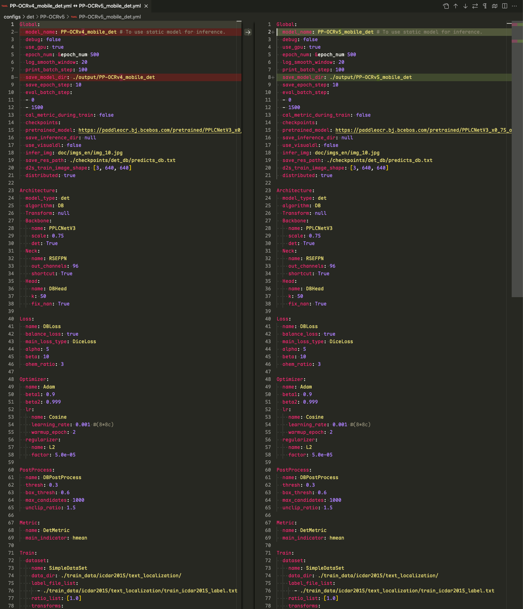

> 该文章主要记录RapidOCR集成PP-OCRv5_mobile_det模型记录的，涉及模型转换，模型精度测试等步骤。

<!-- more -->

### 引言

### 以下代码运行环境

- OS: macOS Sequoia 15.5
- Python: 3.10.14
- PaddlePaddle: 3.0.0
- paddle2onnx: 2.0.2.rc1
- paddlex: 3.0.0
- rapidocr: 2.1.0

### 1. 模型跑通

该步骤主要先基于PaddleX可以正确使用PP-OCRv5_mobile_det模型得到正确结果。

该部分主要参考文档：[docs](https://paddlepaddle.github.io/PaddleX/latest/module_usage/tutorials/ocr_modules/text_recognition.html#_3)

安装`paddlex`:

```bash linenums="1"
pip install "paddlex[ocr]==3.0.0rc1"
```

测试PP-OCRv5_mobile_det模型能否正常识别：

!!! tip

    运行以下代码时，模型会自动下载到 **/Users/用户名/.paddlex/official_models** 下。

```python linenums="1"

from paddleocr import PaddleOCR
# 初始化 PaddleOCR 实例

ocr = PaddleOCR(
    use_doc_orientation_classify=False,
    use_doc_unwarping=False,
    use_textline_orientation=False)

# 对示例图像执行 OCR 推理
result = ocr.predict(
    input="https://paddle-model-ecology.bj.bcebos.com/paddlex/imgs/demo_image/general_ocr_002.png")

# 可视化结果并保存 json 结果
for res in result:
    res.print()
    res.save_to_img("output")
    res.save_to_json("output")
```

预期结果如下，表明成功运行：


### 2. 模型转换

该部分主要参考文档： [docs](https://paddlepaddle.github.io/PaddleX/latest/pipeline_deploy/paddle2onnx.html?h=paddle2onnx#22)

PaddleX官方集成了paddle2onnx的转换代码：

```bash linenums="1"
paddle2onnx --model_dir models/official_models/PP-OCRv5_mobile_det --model_filename inference.json --params_filename inference.pdiparams --save_file models/PP-OCRv5_mobile_det/inference.onnx
```

输出日志如下，日志中存在报错信息，但是最终ONNX模型仍然生成了：

```bash linenums="1" hl_lines="11 16"
/Users/xxxx/miniconda3/envs/py310/lib/python3.10/site-packages/paddle/utils/cpp_extension/extension_utils.py:711: UserWarning: No ccache found. Please be aware that recompiling all source files may be required. You can download and install ccache from: https://github.com/ccache/ccache/blob/master/doc/INSTALL.md
  warnings.warn(warning_message)
[Paddle2ONNX] Start parsing the Paddle model file...
[Paddle2ONNX] Use opset_version = 14 for ONNX export.
[Paddle2ONNX] PaddlePaddle model is exported as ONNX format now.
2025-05-26 11:20:46 [INFO]      Try to perform constant folding on the ONNX model with Polygraphy.
[W] 'colored' module is not installed, will not use colors when logging. To enable colors, please install the 'colored' module: python3 -m pip install colored
[I] Folding Constants | Pass 1
[W] colored module is not installed, will not use colors when logging. To enable colors, please install the colored module: python3 -m pip install colored
[W] Inference failed. You may want to try enabling partitioning to see better results. Note: Error was:
[ONNXRuntimeError] : 1 : FAIL : /Users/runner/work/1/s/onnxruntime/core/graph/model.cc:182 onnxruntime::Model::Model(ModelProto &&, const PathString &, const IOnnxRuntimeOpSchemaRegistryList *, const logging::Logger &, const ModelOptions &) Unsupported model IR version: 11, max supported IR version: 10
[I]     Total Nodes | Original:   925, After Folding:   612 |   313 Nodes Folded
[I] Folding Constants | Pass 2
[W] colored module is not installed, will not use colors when logging. To enable colors, please install the colored module: python3 -m pip install colored
[W] Inference failed. You may want to try enabling partitioning to see better results. Note: Error was:
[ONNXRuntimeError] : 1 : FAIL : /Users/runner/work/1/s/onnxruntime/core/graph/model.cc:182 onnxruntime::Model::Model(ModelProto &&, const PathString &, const IOnnxRuntimeOpSchemaRegistryList *, const logging::Logger &, const ModelOptions &) Unsupported model IR version: 11, max supported IR version: 10
[I]     Total Nodes | Original:   612, After Folding:   612 |     0 Nodes Folded
2025-05-26 11:20:52 [INFO]      ONNX model saved in models/PP-OCRv5_mobile_det/inference.onnx.
```

此时得到的模型，直接用`rapidocr`推理会报错：

```python linenums="1"
from rapidocr import RapidOCR

model_path = "models/PP-OCRv5_mobile_det/inference.onnx"
engine = RapidOCR(params={"Det.model_path": model_path})

img_url = "https://img1.baidu.com/it/u=3619974146,1266987475&fm=253&fmt=auto&app=138&f=JPEG?w=500&h=516"
result = engine(img_url)
print(result)

result.vis("vis_result.jpg")
```

报错信息如下：

```bash linenums="1" hl_lines="15"
[INFO] 2025-05-26 11:21:27,698 [RapidOCR] base.py:41: Using engine_name: onnxruntime
Traceback (most recent call last):
  File "/Users/xxxx/projects/RapidOCR/python/demo.py", line 9, in <module>
    engine = RapidOCR(params={"Det.model_path": model_path})
  File "/Users/xxxx/projects/RapidOCR/python/rapidocr/main.py", line 60, in __init__
    self.text_det = TextDetector(config.Det)
  File "/Users/xxxx/projects/RapidOCR/python/rapidocr/ch_ppocr_det/main.py", line 45, in __init__
    self.session = get_engine(config.engine_name)(config)
  File "/Users/xxxx/projects/RapidOCR/python/rapidocr/inference_engine/onnxruntime.py", line 60, in __init__
    self.session = InferenceSession(
  File "/Users/xxxx/miniconda3/envs/py310/lib/python3.10/site-packages/onnxruntime/capi/onnxruntime_inference_collection.py", line 472, in __init__
    self._create_inference_session(providers, provider_options, disabled_optimizers)
  File "/Users/xxxx/miniconda3/envs/py310/lib/python3.10/site-packages/onnxruntime/capi/onnxruntime_inference_collection.py", line 550, in _create_inference_session
    sess = C.InferenceSession(session_options, self._model_path, True, self._read_config_from_model)
onnxruntime.capi.onnxruntime_pybind11_state.Fail: [ONNXRuntimeError] : 1 : FAIL : Load model from /Users/xxxx/projects/LittleCode/models/PP-OCRv5_mobile_det/inference.onnx failed:/Users/runner/work/1/s/onnxruntime/core/graph/model.cc:182 onnxruntime::Model::Model(ModelProto &&, const PathString &, const IOnnxRuntimeOpSchemaRegistryList *, const logging::Logger &, const ModelOptions &) Unsupported model IR version: 11, max supported IR version: 10
```

经过一系列的查阅资料，终于在onnxruntime issue [#23602](https://github.com/microsoft/onnxruntime/issues/23602#issuecomment-2642348849) 中发现了解决方案。运行下面代码，将上一步所得模型重新指定一下**IR_VERSION**，就可以用`rapidocr`加载推理了。

```python linenums="1"
import onnx
from onnx import version_converter

OPT_VERSION = 14
IR_VERSION = 10

source_path = "models/PP-OCRv5_mobile_det/inference.onnx"
dist_path = "models/PP-OCRv5_mobile_det/inference_v2.onnx"

model = onnx.load(source_path)
model.ir_version = IR_VERSION
model = version_converter.convert_version(model, OPT_VERSION)
onnx.save(model, dist_path)
```

### 3. 模型推理验证

该部分主要是在RapidOCR项目中测试能否直接使用onnx模型。要点主要是确定模型前后处理是否兼容。从PaddleOCR config文件中比较[PP-OCRv4](https://github.com/PaddlePaddle/PaddleOCR/blob/549d83a88b7c75144120e6ec03de80d3eb9e48a5/configs/det/PP-OCRv4/PP-OCRv4_mobile_det.yml)和[PP-OCRv5 mobile det](https://github.com/PaddlePaddle/PaddleOCR/blob/549d83a88b7c75144120e6ec03de80d3eb9e48a5/configs/det/PP-OCRv5/PP-OCRv5_mobile_det.yml)文件差异：



```python linenums="1"
from rapidocr import RapidOCR

model_path = "models/PP-OCRv5_mobile_det/inference.onnx"
engine = RapidOCR(params={"Det.model_path": model_path})

img_url = "https://img1.baidu.com/it/u=3619974146,1266987475&fm=253&fmt=auto&app=138&f=JPEG?w=500&h=516"
result = engine(img_url)
print(result)

result.vis("vis_result.jpg")
```


### 4. 模型精度测试

该部分主要使用[TextDetMetric](https://github.com/SWHL/TextDetMetric)和测试集[text_det_test_dataset](https://huggingface.co/datasets/SWHL/text_det_test_dataset)来评测。

相关测试步骤请参见[TextDetMetric](https://github.com/SWHL/TextRecMetric)的README，一步一步来就行。我这里测试最终精度如下：

```json
{'precision': 0.7861, 'recall': 0.8266, 'hmean': 0.8058, 'avg_elapse': 0.1499}
```

该结果已经更新到[开源OCR模型对比](./model_summary.md)中。

### 5. 集成到rapidocr中

该部分主要包括将字典文件写入到ONNX模型中、托管模型到魔搭、更改rapidocr代码适配等。

#### 托管模型到魔搭

该部分主要是涉及模型上传到对应位置，并合理命名。注意上传完成后，需要打Tag，避免后续rapidocr whl包中找不到模型下载路径。

我这里已经上传到了魔搭上，详细链接参见：[link](https://www.modelscope.cn/models/RapidAI/RapidOCR/files?version=v2.1.0)

#### 更改rapidocr代码适配

该部分主要涉及到更改[default_models.yaml](https://github.com/RapidAI/RapidOCR/blob/4d35ed272a1192afbcb95e823d99eb14c86b7893/python/rapidocr/default_models.yaml)和[paddle.py](https://github.com/RapidAI/RapidOCR/blob/4d35ed272a1192afbcb95e823d99eb14c86b7893/python/rapidocr/inference_engine/paddle.py)的代码来适配。

同时，需要添加对应的单元测试，在保证之前单测成功的同时，新的针对性该模型的单测也能通过。

我这里已经做完了，小伙伴们感兴趣可以去看看源码。

#### 发布新版本

因为这次算是功能新增，按照语义化版本号来看，我们版本号需要从v2.0.7 → v2.1.0。

我只需要在github仓库中，打一个v2.1.0的tag，Github Action会自动跑所有单元测试，自动发版到pypi。

### 写在最后

至此，集成工作就基本完成了。
