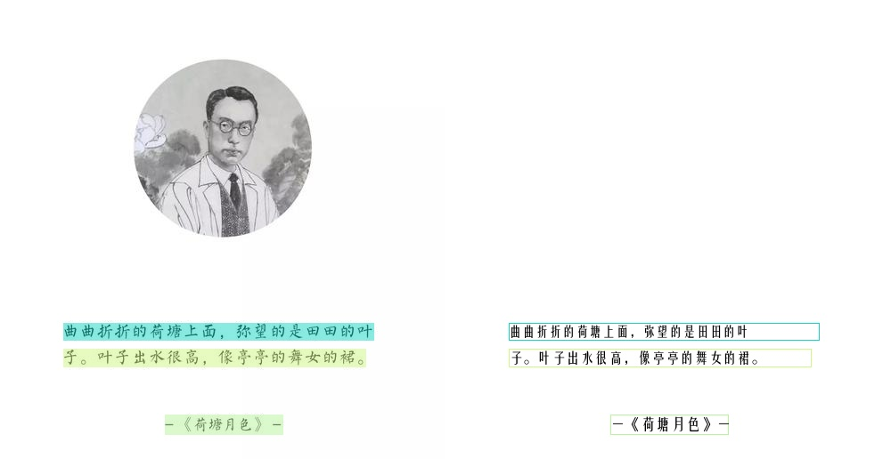

> 该文章主要记录RapidOCR集成PP-OCRv5_mobile_rec和PP-OCRv5_server_rec模型记录的，涉及模型转换，模型精度测试等步骤。

<!-- more -->

### 引言

来自PaddleOCR[官方文档](https://paddlepaddle.github.io/PaddleOCR/latest/version3.x/algorithm/PP-OCRv5/PP-OCRv5.html)：

> PP-OCRv5 是PP-OCR新一代文字识别解决方案，该方案聚焦于多场景、多文字类型的文字识别。在文字类型方面，PP-OCRv5支持简体中文、中文拼音、繁体中文、英文、日文5大主流文字类型，在场景方面，PP-OCRv5升级了中英复杂手写体、竖排文本、生僻字等多种挑战性场景的识别能力。在内部多场景复杂评估集上，PP-OCRv5较PP-OCRv4端到端提升13个百分点。

### 以下代码运行环境

- OS: macOS Sequoia 15.5
- Python: 3.10.14
- PaddlePaddle: 3.0.0
- paddle2onnx: 2.0.2.rc1
- paddlex: 3.0.0
- rapidocr: 2.1.0

### 1. 模型跑通

该步骤主要先基于PaddleX可以正确使用PP-OCRv5_mobile_rec模型得到正确结果。

该部分主要参考文档：[docs](https://paddlepaddle.github.io/PaddleX/latest/module_usage/tutorials/ocr_modules/text_recognition.html#_3)

安装`paddlex`:

```bash linenums="1"
pip install "paddlex[ocr]==3.0.0"
```

测试PP-OCRv5_mobile_rec模型能否正常识别：

!!! tip

    运行以下代码时，模型会自动下载到 **/Users/用户名/.paddlex/official_models** 下。

测试图：[link](https://paddle-model-ecology.bj.bcebos.com/paddlex/imgs/demo_image/general_ocr_rec_001.png)

```python linenums="1"

from paddlex import create_model

# PP-OCRv5_server_rec 同理
model = create_model(model_name="PP-OCRv5_mobile_rec")

img_path = "images/general_ocr_rec_001.png"

output = model.predict(input=img_path, batch_size=1)
for res in output:
    res.print()
    res.save_to_img(save_path="./output/")
    res.save_to_json(save_path="./output/res.json")
```

预期结果如下，表明成功运行：


### 2. 模型转换

该部分主要参考文档： [docs](https://paddlepaddle.github.io/PaddleX/latest/pipeline_deploy/paddle2onnx.html?h=paddle2onnx#22)

=== "转换PP-OCRv5_mobile_rec"

    PaddleX官方集成了paddle2onnx的转换代码：

    ```bash linenums="1"
    paddlex --install paddle2onnx
    pip install onnx==1.16.0

    paddlex --paddle2onnx --paddle_model_dir models/official_models/PP-OCRv5_mobile_rec --onnx_model_dir models/PP-OCRv5_mobile_rec
    ```

    输出日志如下，表明转换成功：

    ```bash linenums="1"
    Input dir: models/official_models/PP-OCRv5_mobile_rec
    Output dir: models/PP-OCRv5_mobile_rec
    Paddle2ONNX conversion starting...
    /Users/xxxx/miniconda3/envs/py310/lib/python3.10/site-packages/paddle/utils/cpp_extension/extension_utils.py:711: UserWarning: No ccache found. Please be aware that recompiling all source files may be required. You can download and install ccache from: <https://github.com/ccache/ccache/blob/master/doc/INSTALL.md>
    warnings.warn(warning_message)
    [Paddle2ONNX] Start parsing the Paddle model file...
    [Paddle2ONNX] Use opset_version = 14 for ONNX export.
    [Paddle2ONNX] PaddlePaddle model is exported as ONNX format now.
    2025-05-30 08:16:38 [INFO]      Try to perform constant folding on the ONNX model with Polygraphy.
    [W] 'colored' module is not installed, will not use colors when logging. To enable colors, please install the 'colored' module: python3 -m pip install colored
    [I] Folding Constants | Pass 1
    [I]     Total Nodes | Original:  1029, After Folding:   550 |   479 Nodes Folded
    [I] Folding Constants | Pass 2
    [I]     Total Nodes | Original:   550, After Folding:   550 |     0 Nodes Folded
    2025-05-30 08:16:40 [INFO]      ONNX model saved in models/PP-OCRv5_mobile_rec/inference.onnx.
    Paddle2ONNX conversion succeeded
    Copied models/official_models/PP-OCRv5_mobile_rec/inference.yml to models/PP-OCRv5_mobile_rec/inference.yml
    Done
    ```

=== "转换PP-OCRv5_server_rec"

    PaddleX官方集成了paddle2onnx的转换代码：

    ```bash linenums="1"
    paddlex --install paddle2onnx
    pip install onnx==1.16.0

    paddlex --paddle2onnx --paddle_model_dir models/official_models/PP-OCRv5_server_rec --onnx_model_dir models/PP-OCRv5_server_rec
    ```

    输出日志如下，表明转换成功：

    ```bash linenums="1"
    Input dir: models/official_models/PP-OCRv5_server_rec
    Output dir: models/PP-OCRv5_server_rec
    Paddle2ONNX conversion starting...
    /Users/xxxx/miniconda3/envs/py310/lib/python3.10/site-packages/paddle/utils/cpp_extension/extension_utils.py:711: UserWarning: No ccache found. Please be aware that recompiling all source files may be required. You can download and install ccache from: <https://github.com/ccache/ccache/blob/master/doc/INSTALL.md>
    warnings.warn(warning_message)
    [Paddle2ONNX] Start parsing the Paddle model file...
    [Paddle2ONNX] Use opset_version = 10 for ONNX export.
    [Paddle2ONNX] PaddlePaddle model is exported as ONNX format now.
    2025-05-30 08:19:17 [INFO]      Try to perform constant folding on the ONNX model with Polygraphy.
    [W] 'colored' module is not installed, will not use colors when logging. To enable colors, please install the 'colored' module: python3 -m pip install colored
    [I] Folding Constants | Pass 1
    [I]     Total Nodes | Original:  1111, After Folding:   512 |   599 Nodes Folded
    [I] Folding Constants | Pass 2
    [I]     Total Nodes | Original:   512, After Folding:   512 |     0 Nodes Folded
    2025-05-30 08:19:19 [INFO]      ONNX model saved in models/PP-OCRv5_server_rec/inference.onnx.
    Paddle2ONNX conversion succeeded
    Copied models/official_models/PP-OCRv5_server_rec/inference.yml to models/PP-OCRv5_server_rec/inference.yml
    Done
    ```

### 3. 模型推理验证

=== "验证PP-OCRv5_mobile_rec模型"

    该部分主要是在RapidOCR项目中测试能否直接使用onnx模型。要点主要是确定模型前后处理是否兼容。从PaddleOCR config文件中比较[PP-OCRv4](https://github.com/PaddlePaddle/PaddleOCR/blob/6dce3e0b1fee4b8b0a90ac55f0bf5dbed2de6af4/configs/rec/PP-OCRv4/en_PP-OCRv4_mobile_rec.yml)和[PP-OCRv5 mobile det](https://github.com/PaddlePaddle/PaddleOCR/blob/6dce3e0b1fee4b8b0a90ac55f0bf5dbed2de6af4/configs/rec/PP-OCRv5/PP-OCRv5_server_rec.yml)文件差异：

    

    从上图中可以看出，配置基本一模一样，因此现有`rapidocr`前后推理代码可以直接使用。

    ```python linenums="1"
    from rapidocr import RapidOCR

    model_path = "models/PP-OCRv5_mobile_rec/inference.onnx"
    dict_path = "models/PP-OCRv5_mobile_rec/ppocrv5_dict.txt"
    engine = RapidOCR(params={"Rec.model_path": model_path, "Rec.rec_keys_path": dict_path})

    img_url = "<https://img1.baidu.com/it/u=3619974146,1266987475&fm=253&fmt=auto&app=138&f=JPEG?w=500&h=516>"
    result = engine(img_url)
    print(result)

    result.vis("vis_result.jpg")
    ```

    

=== "验证PP-OCRv5_server_rec模型"

    该部分主要是在RapidOCR项目中测试能否直接使用onnx模型。要点主要是确定模型前后处理是否兼容。从PaddleOCR config文件中比较[PP-OCRv4_server_rec](https://github.com/PaddlePaddle/PaddleOCR/blob/6dce3e0b1fee4b8b0a90ac55f0bf5dbed2de6af4/configs/rec/PP-OCRv4/PP-OCRv4_server_rec.yml)和[PP-OCRv5_server_rec](https://github.com/PaddlePaddle/PaddleOCR/blob/6dce3e0b1fee4b8b0a90ac55f0bf5dbed2de6af4/configs/rec/PP-OCRv5/PP-OCRv5_server_rec.yml)文件差异：

    

    从上图中可以看出，配置基本一模一样，backbone换了，但是前后处理配置是一样的。因此现有`rapidocr`前后推理代码可以直接使用。

    ```python linenums="1"
    from rapidocr import RapidOCR

    model_path = "models/PP-OCRv5_server_rec/inference.onnx"
    engine = RapidOCR(params={"Det.model_path": model_path})

    img_url = "https://img1.baidu.com/it/u=3619974146,1266987475&fm=253&fmt=auto&app=138&f=JPEG?w=500&h=516"
    result = engine(img_url)
    print(result)

    result.vis("vis_result.jpg")
    ```

    

### 4. 模型精度测试

!!! warning

    测试集[text_det_test_dataset](https://huggingface.co/datasets/SWHL/text_det_test_dataset)包括卡证类、文档类和自然场景三大类。其中卡证类有82张，文档类有75张，自然场景类有55张。缺少手写体、繁体、日文、古籍文本、拼音、艺术字等数据。因此，该基于该测评集的结果仅供参考。

    欢迎有兴趣的小伙伴，可以和我们一起共建更加全面的测评集。

该部分主要使用[TextRecMetric](https://github.com/SWHL/TextRecMetric)和测试集[text_rec_test_dataset](https://huggingface.co/datasets/SWHL/text_rec_test_dataset)来评测。

需要注意的是，**PP-OCRv5_rec系列模型更加侧重简体中文、中文拼音、繁体中文、英文、日文5大主流文字类型，在场景方面，PP-OCRv5升级了中英复杂手写体、竖排文本、生僻字等多种挑战性场景。** 当前测试集并未着重收集中文拼音、繁体中文和日文数据。因此以下指标会有些偏低。如需自己使用，请在自己场景下测试效果。

相关测试步骤请参见[TextRecMetric](https://github.com/SWHL/TextRecMetric)的README，一步一步来就行。

⚠️注意：下面代码用的是即将发布`rapidocr==3.0.0`版本代码，想要复现的小伙伴，可以稍微等等。

其中，下面代码仅写了mobile模型测试，如果想测server模型，将 **mobile** 字段换为 **server** 即可。计算 **pred.txt** 代码如下：

=== "(Exp1) PaddleX框架+Paddle格式模型"

    ```python linenums="1" hl_lines="10"
    import time

    import cv2
    import numpy as np
    from datasets import load_dataset
    from tqdm import tqdm

    from paddlex import create_model

    engine = create_model(model_name="PP-OCRv5_mobile_rec")

    dataset = load_dataset("SWHL/text_rec_test_dataset")
    test_data = dataset["test"]

    content = []
    for i, one_data in enumerate(tqdm(test_data)):
        img = np.array(one_data.get("image"))
        img = cv2.cvtColor(img, cv2.COLOR_RGB2BGR)

        t0 = time.perf_counter()
        result = next(engine.predict(input=img, batch_size=1))
        elapse = time.perf_counter() - t0

        rec_text = result["rec_text"]
        if len(rec_text) <= 0:
            rec_text = ""
            elapse = 0

        gt = one_data.get("label", None)
        content.append(f"{rec_text}\t{gt}\t{elapse}")

    with open("pred.txt", "w", encoding="utf-8") as f:
        for v in content:
            f.write(f"{v}\n")
    ```

=== "(Exp2)RapidOCR框架+Paddle格式模型"

    ```python linenums="1" hl_lines="10-19"
    import time

    import cv2
    import numpy as np
    from datasets import load_dataset
    from tqdm import tqdm

    from rapidocr import EngineType, OCRVersion, RapidOCR

    model_path = "models/official_models/PP-OCRv5_mobile_rec"
    dict_path = "models/PP-OCRv5_mobile_rec/ppocrv5_dict.txt"
    engine = RapidOCR(
        params={
            "Rec.model_dir": model_path,
            "Rec.rec_keys_path": dict_path,
            "Rec.engine_type": EngineType.PADDLE,
            "Rec.ocr_version": OCRVersion.PPOCRV5,
        }
    )

    dataset = load_dataset("SWHL/text_rec_test_dataset")
    test_data = dataset["test"]

    content = []
    for i, one_data in enumerate(tqdm(test_data)):
        img = np.array(one_data.get("image"))
        img = cv2.cvtColor(img, cv2.COLOR_RGB2BGR)

        t0 = time.perf_counter()
        result = engine(img, use_rec=True, use_cls=False, use_det=False)
        elapse = time.perf_counter() - t0

        rec_text = result.txts[0]
        if len(rec_text) <= 0:
            rec_text = ""
            elapse = 0

        gt = one_data.get("label", None)
        content.append(f"{rec_text}\t{gt}\t{elapse}")

    with open("pred.txt", "w", encoding="utf-8") as f:
        for v in content:
            f.write(f"{v}\n")
    ```

=== "(Exp3)RapidOCR框架+ONNXRuntime格式模型"

    ```python linenums="1" hl_lines="10-17"
    import time

    import cv2
    import numpy as np
    from datasets import load_dataset
    from tqdm import tqdm

    from rapidocr import EngineType, OCRVersion, RapidOCR

    model_path = "models/PP-OCRv5_mobile_rec/inference.onnx"
    dict_path = "models/PP-OCRv5_mobile_rec/ppocrv5_dict.txt"
    engine = RapidOCR(
        params={
            "Rec.model_path": model_path,
            "Rec.rec_keys_path": dict_path,
        }
    )

    dataset = load_dataset("SWHL/text_rec_test_dataset")
    test_data = dataset["test"]

    content = []
    for i, one_data in enumerate(tqdm(test_data)):
        img = np.array(one_data.get("image"))
        img = cv2.cvtColor(img, cv2.COLOR_RGB2BGR)

        t0 = time.perf_counter()
        result = engine(img, use_rec=True, use_cls=False, use_det=False)
        elapse = time.perf_counter() - t0

        rec_text = result.txts[0]
        if len(rec_text) <= 0:
            rec_text = ""
            elapse = 0

        gt = one_data.get("label", None)
        content.append(f"{rec_text}\t{gt}\t{elapse}")

    with open("pred.txt", "w", encoding="utf-8") as f:
        for v in content:
            f.write(f"{v}\n")
    ```

计算指标代码：

```python linenums="1"
from text_rec_metric import TextRecMetric

metric = TextRecMetric()

pred_path = "pred.txt"
metric = metric(pred_path)
print(metric)
```

指标汇总如下（以下指标均为CPU下计算所得）：

|Exp|模型|推理框架|模型格式|ExactMatch↑|CharMatch↑|Elapse↓|
|:---:|:---|:---|:---|:---:|:---:|:---:|
|1|PP-OCRv5_mobile_rec|PaddleX |PaddlePaddle|0.7323|0.9161|0.0778|
|2|PP-OCRv5_mobile_rec|RapidOCR| PaddlePaddle|0.7355|0.9177|0.0772|
|3|PP-OCRv5_mobile_rec|RapidOCR| ONNXRuntime|0.7355|0.9177|0.0174|
|4|PP-OCRv4_mobile_rec|RapidOCR |ONNXRuntime|**0.8323**|**0.9355**|-|
||||||||
|5|PP-OCRv5_server_rec|PaddleX |PaddlePaddle|0.8097|0.9424|0.0777|
|6|PP-OCRv5_server_rec|RapidOCR |PaddlePaddle|0.8129|0.9431|0.0775|
|7|PP-OCRv5_server_rec|RapidOCR| ONNXRuntime|**0.8129**|**0.9431**|0.0655|
|8|PP-OCRv4_server_rec|RapidOCR |ONNXRuntime|0.7968|0.9381|-|
|9|PP-OCRv4_doc_server_rec|RapidOCR |ONNXRuntime|0.8098|0.9444|-|

从以上结果来看，可以得到以下结论：

1. Exp1和Exp2相比，指标差异不大，说明文本识别 **前后处理代码可以共用** 。
2. Exp2和Exp3相比，mobile模型转换为ONNX格式后，指标几乎一致，说明 **模型转换前后，误差较小，推理速度也有提升** 。
3. Exp3和Exp4相比，mobile整体指标弱于PP-OCRv4的。因为测评集集中在中英文的印刷体，手写体少些，因此仅供参考。
4. Exp6和Exp7相比，指标差异不大，说明更换backbone后的文本识别模型转换为ONNX格式，精度没有影响。Paddle2ONNX工具太强了！
5. Exp7和Exp8相比，PP-OCRv5 server模型有很大提升。当然，不排除训练用到了测评集数据。

!!! tip

    - 如果是单一中英文场景，建议用PP-OCRv4系列
    - 如果是中英日、印刷和手写体混合场景，建议用PP-OCRv5系列

上述表格中基于ONNXRuntime的结果已经更新到[开源OCR模型对比](./model_summary.md)中。

### 5. 集成到rapidocr中

该部分主要包括将字典文件写入ONNX模型、托管模型到魔搭和更改rapidocr代码适配等。

#### 字典文件写入ONNX模型

该步骤仅存在文本识别模型中，文本检测模型没有这个步骤。

??? info "详细代码"

    ```python linenums="1"
    from pathlib import Path
    from typing import List, Union

    import onnx
    import onnxruntime as ort
    from onnx import ModelProto


    def read_txt(txt_path: Union[Path, str]) -> List[str]:
        with open(txt_path, "r", encoding="utf-8") as f:
            data = [v.rstrip("\n") for v in f]
        return data


    class ONNXMetaOp:
        @classmethod
        def add_meta(
            cls,
            model_path: Union[str, Path],
            key: str,
            value: List[str],
            delimiter: str = "\n",
        ) -> ModelProto:
            model = onnx.load_model(model_path)
            meta = model.metadata_props.add()
            meta.key = key
            meta.value = delimiter.join(value)
            return model

        @classmethod
        def get_meta(
            cls, model_path: Union[str, Path], key: str, split_sym: str = "\n"
        ) -> List[str]:
            sess = ort.InferenceSession(model_path)
            meta_map = sess.get_modelmeta().custom_metadata_map
            key_content = meta_map.get(key)
            key_list = key_content.split(split_sym)
            return key_list

        @classmethod
        def del_meta(cls, model_path: Union[str, Path]) -> ModelProto:
            model = onnx.load_model(model_path)
            del model.metadata_props[:]
            return model

        @classmethod
        def save_model(cls, save_path: Union[str, Path], model: ModelProto):
            onnx.save_model(model, save_path)


    dicts = read_txt("models/PP-OCRv5_mobile_rec/ppocrv5_dict.txt")
    model_path = "models/PP-OCRv5_server_rec/inference.onnx"
    model = ONNXMetaOp.add_meta(model_path, key="character", value=dicts)

    new_model_path = Path(model_path).parent / "ch_PP-OCRv5_rec_server_infer.onnx"
    ONNXMetaOp.save_model(new_model_path, model)

    t = ONNXMetaOp.get_meta(new_model_path, key="character")
    print(t)
    print(len(t))
    ```

#### 托管模型到魔搭

该部分主要是涉及模型上传到对应位置，并合理命名。注意上传完成后，需要打Tag，避免后续rapidocr whl包中找不到模型下载路径。

我这里已经上传到了魔搭上，详细链接参见：[link](https://www.modelscope.cn/models/RapidAI/RapidOCR/files)

#### 更改rapidocr代码适配

该部分主要涉及到更改[default_models.yaml](https://github.com/RapidAI/RapidOCR/blob/4d35ed272a1192afbcb95e823d99eb14c86b7893/python/rapidocr/default_models.yaml)和[paddle.py](https://github.com/RapidAI/RapidOCR/blob/4d35ed272a1192afbcb95e823d99eb14c86b7893/python/rapidocr/inference_engine/paddle.py)的代码来适配。

同时，需要添加对应的单元测试，在保证之前单测成功的同时，新的针对性该模型的单测也能通过。

我这里已经做完了，小伙伴们感兴趣可以去看看源码。

### 写在最后

至此，该部分集成工作就基本完成了。这部分代码会集成到`rapidocr==3.0.0`中。版本号之所以从v2.1.0到v3.0.0，原因是：语义化版本号。

我在集成过程中，发现v2.1.0中字段不太合理，做了一些改进，动了外部API，因此只能升大版本号。请大家在使用过程中，注意查看最新文档→ [docs](https://rapidai.github.io/RapidOCRDocs/main/install_usage/rapidocr/usage/) 。
