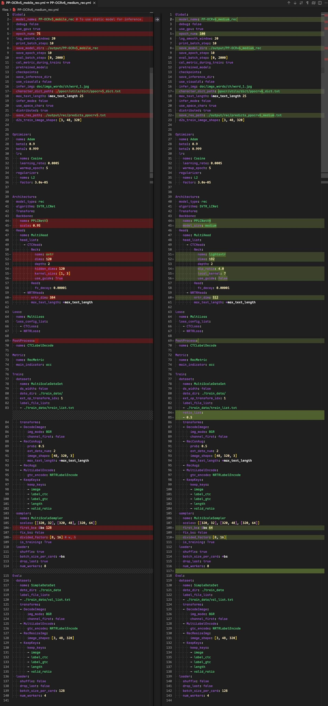

<!-- more -->

### 引言

来自 PaddleOCR[官方文档](https://www.paddleocr.ai/latest/version3.x/algorithm/PP-OCRv6/PP-OCRv6.html)：

> PP-OCRv6 是 PP-OCR 最新一代通用文字识别解决方案。PP-OCRv6 基于全新设计的 PPLCNetV4 统一骨干网络，提供 tiny, small, medium 三档模型，分别面向端侧 /IoT、移动端 / 桌面端、服务端场景。PP-OCRv6 在语言覆盖方面实现重大突破，medium/small 档单一模型统一支持简体中文、繁体中文、英文、日文及 46 种拉丁语系语言共 50 种语言（tiny 档支持 49 种，不含日文）。在内部多场景综合评估集上，PP-OCRv6_medium 相比 PP-OCRv5_server 识别精度提升 5.1%、检测精度提升 4.6%，同时 GPU 推理速度提升 2.37×；以仅 34.5M 参数的规模，精度超越 Qwen3-VL-235B, GPT-5.5 等大型视觉语言模型。

官方模型托管地址：https://www.modelscope.cn/collections/PaddlePaddle/PP-OCRv6

### 以下代码运行环境

- OS: macOS Tahoe 26.5.1
- Python: 3.10.14
- PaddlePaddle: 3.1.0
- paddle2onnx: 2.1.0
- paddlex: 3.7.1
- rapidocr: 3.8.4

### 1. 模型跑通

该步骤主要先基于 PaddleX 可以正确使用 PP-OCRv6_medium_rec 模型得到正确结果。

该部分主要参考文档：[docs](https://paddlepaddle.github.io/PaddleX/latest/module_usage/tutorials/ocr_modules/text_recognition.html)

安装 `paddlex`:

```bash linenums="1"
pip install "paddlex[ocr]==3.7.1"
```

测试 PP-OCRv6_medium_rec 模型能否正常识别：

!!! tip

    运行以下代码时，模型会自动下载到 **/Users/用户名/.paddlex/official_models** 下。

测试图：[link](https://paddle-model-ecology.bj.bcebos.com/paddlex/imgs/demo_image/general_ocr_rec_001.png)

```python linenums="1"
from paddlex import create_model

# PP-OCRv6_medium_rec / PP-OCRv6_small_rec / PP-OCRv6_tiny_rec
model = create_model(model_name="PP-OCRv6_small_rec")
output = model.predict(input="images/general_ocr_rec_001.png", batch_size=1)
for res in output:
    res.print()
    res.save_to_img(save_path="./output/")
    res.save_to_json(save_path="./output/res.json")
```

预期结果如下，表明成功运行：


### 2. 模型转换

该部分主要参考文档：[docs](https://paddlepaddle.github.io/PaddleX/latest/pipeline_deploy/paddle2onnx.html?h=paddle2onnx#22)

=== "转换 PP-OCRv6_medium_rec"

    PaddleX 官方集成了 paddle2onnx 的转换代码：

    ```bash linenums="1"
    paddlex --install paddle2onnx
    pip install onnx==1.17.0

    paddlex --paddle2onnx --paddle_model_dir models/official_models/PP-OCRv6_medium_rec --onnx_model_dir models/PP-OCRv6_medium_rec
    ```

    输出日志如下，表明转换成功：

    ```bash linenums="1"
    Input dir: models/official_models/PP-OCRv6_medium_rec
    Output dir: models/PP-OCRv6_rec_medium
    Paddle2ONNX conversion starting...
    /Users/xxxx/miniconda3/envs/py310/lib/python3.10/site-packages/paddle/utils/cpp_extension/extension_utils.py:715: UserWarning: No ccache found. Please be aware that recompiling all source files may be required. You can download and install ccache from: https://github.com/ccache/ccache/blob/master/doc/INSTALL.md
    warnings.warn(warning_message)
    [Paddle2ONNX] Start parsing the Paddle model file...
    [Paddle2ONNX] Use opset_version = 11 for ONNX export.
    [Paddle2ONNX] PaddlePaddle model is exported as ONNX format now.
    2026-06-18 14:24:04 [INFO]      Try to perform constant folding on the ONNX model with Polygraphy.
    [W] 'colored' module is not installed, will not use colors when logging. To enable colors, please install the 'colored' module: python3 -m pip install colored
    [I] Folding Constants | Pass 1
    [I]     Total Nodes | Original:  1035, After Folding:   507 |   528 Nodes Folded
    [I] Folding Constants | Pass 2
    [I]     Total Nodes | Original:   507, After Folding:   507 |     0 Nodes Folded
    2026-06-18 14:24:06 [INFO]      ONNX model saved in models/PP-OCRv6_rec_medium/inference.onnx.
    Paddle2ONNX conversion succeeded
    Copied models/official_models/PP-OCRv6_medium_rec/inference.yml to models/PP-OCRv6_rec_medium/inference.yml
    Done
    ```

=== "转换 PP-OCRv6_small_rec"

    PaddleX 官方集成了 paddle2onnx 的转换代码：

    ```bash linenums="1"
    paddlex --install paddle2onnx
    pip install onnx==1.17.0

    paddlex --paddle2onnx --paddle_model_dir models/official_models/PP-OCRv6_small_rec --onnx_model_dir models/PP-OCRv6_rec_small
    ```

    输出日志如下，表明转换成功：

    ```bash linenums="1"
    Input dir: models/official_models/PP-OCRv6_small_rec
    Output dir: models/PP-OCRv6_rec_small
    Paddle2ONNX conversion starting...
    /Users/xxxx/miniconda3/envs/py310/lib/python3.10/site-packages/paddle/utils/cpp_extension/extension_utils.py:715: UserWarning: No ccache found. Please be aware that recompiling all source files may be required. You can download and install ccache from: https://github.com/ccache/ccache/blob/master/doc/INSTALL.md
    warnings.warn(warning_message)
    [Paddle2ONNX] Start parsing the Paddle model file...
    [Paddle2ONNX] Use opset_version = 11 for ONNX export.
    [Paddle2ONNX] PaddlePaddle model is exported as ONNX format now.
    2026-06-18 14:25:24 [INFO]      Try to perform constant folding on the ONNX model with Polygraphy.
    [W] 'colored' module is not installed, will not use colors when logging. To enable colors, please install the 'colored' module: python3 -m pip install colored
    [I] Folding Constants | Pass 1
    [I]     Total Nodes | Original:   979, After Folding:   480 |   499 Nodes Folded
    [I] Folding Constants | Pass 2
    [I]     Total Nodes | Original:   480, After Folding:   480 |     0 Nodes Folded
    2026-06-18 14:25:25 [INFO]      ONNX model saved in models/PP-OCRv6_rec_small/inference.onnx.
    Paddle2ONNX conversion succeeded
    Copied models/official_models/PP-OCRv6_small_rec/inference.yml to models/PP-OCRv6_rec_small/inference.yml
    Done
    ```

=== "转换 PP-OCRv6_tiny_rec"

    PaddleX 官方集成了 paddle2onnx 的转换代码：

    ```bash linenums="1"
    paddlex --install paddle2onnx
    pip install onnx==1.17.0

    paddlex --paddle2onnx --paddle_model_dir models/official_models/PP-OCRv6_tiny_rec --onnx_model_dir models/PP-OCRv6_rec_tiny
    ```

    输出日志如下，表明转换成功：

    ```bash linenums="1"
    Input dir: models/official_models/PP-OCRv6_tiny_rec
    Output dir: models/PP-OCRv6_rec_tiny
    Paddle2ONNX conversion starting...
    /Users/xxxx/miniconda3/envs/py310/lib/python3.10/site-packages/paddle/utils/cpp_extension/extension_utils.py:715: UserWarning: No ccache found. Please be aware that recompiling all source files may be required. You can download and install ccache from: https://github.com/ccache/ccache/blob/master/doc/INSTALL.md
    warnings.warn(warning_message)
    [Paddle2ONNX] Start parsing the Paddle model file...
    [Paddle2ONNX] Use opset_version = 11 for ONNX export.
    [Paddle2ONNX] PaddlePaddle model is exported as ONNX format now.
    2026-06-18 14:25:30 [INFO]      Try to perform constant folding on the ONNX model with Polygraphy.
    [W] 'colored' module is not installed, will not use colors when logging. To enable colors, please install the 'colored' module: python3 -m pip install colored
    [I] Folding Constants | Pass 1
    2026-06-18 14:25:30.244 python3.10[80255:9832531] 2026-06-18 14:25:30.243456 [W:onnxruntime:, unsqueeze_elimination.cc:23 Apply] UnsqueezeElimination cannot remove node Unsqueeze.3
    2026-06-18 14:25:30.245 python3.10[80255:9832531] 2026-06-18 14:25:30.245015 [W:onnxruntime:, unsqueeze_elimination.cc:23 Apply] UnsqueezeElimination cannot remove node Unsqueeze.0
    [I]     Total Nodes | Original:   459, After Folding:   219 |   240 Nodes Folded
    [I] Folding Constants | Pass 2
    [I]     Total Nodes | Original:   219, After Folding:   219 |     0 Nodes Folded
    2026-06-18 14:25:31 [INFO]      ONNX model saved in models/PP-OCRv6_rec_tiny/inference.onnx.
    Paddle2ONNX conversion succeeded
    Copied models/official_models/PP-OCRv6_tiny_rec/inference.yml to models/PP-OCRv6_rec_tiny/inference.yml
    Done
    ```

### 3. 模型推理验证

我这里主要验证 PP-OCRv6_medium_rec 模型，small 和 tiny 版除了参数量区别外，其余都一样，因此不做重复验证。

该部分主要是在 RapidOCR 项目中测试能否直接使用 onnx 模型。要点主要是确定模型前后处理是否兼容。从 PaddleOCR config 文件中比较 [PP-OCRv5_mobile_rec](https://github.com/PaddlePaddle/PaddleOCR/blob/ef346e0b402934477489001a4d253a20dbeb72a5/configs/rec/PP-OCRv5/PP-OCRv5_mobile_rec.yml) 和 [PP-OCRv6_medium_rec](https://github.com/PaddlePaddle/PaddleOCR/blob/ef346e0b402934477489001a4d253a20dbeb72a5/configs/rec/PP-OCRv6/PP-OCRv6_medium_rec.yml) 文件差异：



从上图中可以看出，配置基本一模一样，backbone 换了，但是前后处理配置是一样的。因此现有 `rapidocr` 前后推理代码可以直接使用。

```python linenums="1"
from rapidocr import RapidOCR

model_path = "models/PP-OCRv6_rec_medium/inference.onnx"
dict_path = "models/dict/ppocrv6_dict.txt"
engine = RapidOCR(params={"Rec.model_path": model_path, "Rec.rec_keys_path": dict_path})

img_url = "https://paddle-model-ecology.bj.bcebos.com/paddlex/imgs/demo_image/general_ocr_rec_001.png"
result = engine(img_url)
print(result)

result.vis("vis_result.jpg")
```


### 4. 模型精度测试

!!! warning

    测试集 [text_det_test_dataset](https://huggingface.co/datasets/SWHL/text_det_test_dataset) 包括卡证类、文档类和自然场景三大类。其中卡证类有 82 张，文档类有 75 张，自然场景类有 55 张。缺少手写体、繁体、日文、古籍文本、拼音、艺术字等数据。因此，该基于该测评集的结果仅供参考。

    欢迎有兴趣的小伙伴，可以和我们一起共建更加全面的测评集。

该部分主要使用 [TextRecMetric](https://github.com/SWHL/TextRecMetric) 和测试集 [text_rec_test_dataset](https://huggingface.co/datasets/SWHL/text_rec_test_dataset) 来评测。

需要注意的是，**PP-OCRv6 rec系列模型在语言覆盖单一模型统一支持简体中文、繁体中文、英文、日文及 46 种拉丁语系语言共 50 种语言（tiny 档支持 49 种，不含日文）。** 当前测试集并未着重收集以上场景。因此以下指标会有些偏低。如需自己使用，请在自己场景下测试效果。

需要安装的包如下：

```bash linenums="1"
pip install datasets
pip install text_rec_metric
```

⚠️注意：下面代码用的是 `rapidocr==3.8.4` 版本。其中，下面代码仅写了 medium 模型测试，small 和 tiny 模型同理。

=== "(Exp1) PaddleX 框架 + Paddle 格式模型"

    ```python linenums="1" hl_lines="10"
    import time

    import cv2
    import numpy as np
    from paddlex import create_model
    from tqdm import tqdm

    from datasets import load_dataset

    engine = create_model(model_name="PP-OCRv6_medium_rec")

    dataset = load_dataset("SWHL/text_rec_test_dataset")
    test_data = dataset["test"]

    content = []
    for i, one_data in enumerate(tqdm(test_data)):
        img = np.array(one_data.get("image"))
        img = cv2.cvtColor(img, cv2.COLOR_RGB2BGR)

        t0 = time.perf_counter()
        result = next(engine.predict(input=img, batch_size=1))
        elapse = time.perf_counter() - t0

        rec_text = result["rec_text"]
        if len(rec_text) <= 0:
            rec_text = ""
            elapse = 0

        gt = one_data.get("label", None)
        content.append(f"{rec_text}\t{gt}\t{elapse}")

    with open("pred.txt", "w", encoding="utf-8") as f:
        for v in content:
            f.write(f"{v}\n")

    from text_rec_metric import TextRecMetric

    metric = TextRecMetric()

    pred_path = "pred.txt"
    metric = metric(pred_path)
    print(metric)
    ```

=== "(Exp2) RapidOCR 框架 + Paddle 格式模型"

    ```python linenums="1" hl_lines="10-19"
    import time

    import cv2
    import numpy as np
    from rapidocr import EngineType, OCRVersion, RapidOCR
    from tqdm import tqdm

    from datasets import load_dataset

    model_path = "models/official_models/PP-OCRv6_medium_rec"
    dict_path = "models/dict/ppocrv6_dict.txt"
    engine = RapidOCR(
        params={
            "Rec.model_dir": model_path,
            "Rec.rec_keys_path": dict_path,
            "Rec.engine_type": EngineType.PADDLE,
            "Rec.ocr_version": OCRVersion.PPOCRV5,
        }
    )

    dataset = load_dataset("SWHL/text_rec_test_dataset")
    test_data = dataset["test"]

    content = []
    for i, one_data in enumerate(tqdm(test_data)):
        img = np.array(one_data.get("image"))
        img = cv2.cvtColor(img, cv2.COLOR_RGB2BGR)

        t0 = time.perf_counter()
        result = engine(img, use_rec=True, use_cls=False, use_det=False)
        elapse = time.perf_counter() - t0

        rec_text = result.txts[0]
        if len(rec_text) <= 0:
            rec_text = ""
            elapse = 0

        gt = one_data.get("label", None)
        content.append(f"{rec_text}\t{gt}\t{elapse}")

    with open("pred.txt", "w", encoding="utf-8") as f:
        for v in content:
            f.write(f"{v}\n")

    from text_rec_metric import TextRecMetric

    metric = TextRecMetric()

    pred_path = "pred.txt"
    metric = metric(pred_path)
    print(metric)
    ```

=== "(Exp3)RapidOCR 框架+ONNX Runtime 格式模型"

    ```python linenums="1" hl_lines="10-17"
    import time

    import cv2
    import numpy as np
    from rapidocr import RapidOCR
    from tqdm import tqdm

    from datasets import load_dataset

    model_path = "models/PP-OCRv6_rec_medium/inference.onnx"
    dict_path = "models/dict/ppocrv6_dict.txt"
    engine = RapidOCR(
        params={
            "Rec.model_path": model_path,
            "Rec.rec_keys_path": dict_path,
        }
    )

    dataset = load_dataset("SWHL/text_rec_test_dataset")
    test_data = dataset["test"]

    content = []
    for i, one_data in enumerate(tqdm(test_data)):
        img = np.array(one_data.get("image"))
        img = cv2.cvtColor(img, cv2.COLOR_RGB2BGR)

        t0 = time.perf_counter()
        result = engine(img, use_rec=True, use_cls=False, use_det=False)
        elapse = time.perf_counter() - t0

        rec_text = result.txts[0]
        if len(rec_text) <= 0:
            rec_text = ""
            elapse = 0

        gt = one_data.get("label", None)
        content.append(f"{rec_text}\t{gt}\t{elapse}")

    with open("pred.txt", "w", encoding="utf-8") as f:
        for v in content:
            f.write(f"{v}\n")

    from text_rec_metric import TextRecMetric

    metric = TextRecMetric()

    pred_path = "pred.txt"
    metric = metric(pred_path)
    print(metric)
    ```

指标汇总如下（以下指标均为 CPU 下计算所得）：

|Exp|模型|推理框架|模型格式|ExactMatch↑|CharMatch↑|Elapse↓|
|:---:|:---|:---|:---|:---:|:---:|:---:|
|1|PP-OCRv6_medium_rec| PaddleX |PaddlePaddle|0.8677|0.9512|0.0606|
|2|PP-OCRv6_small_rec| PaddleX |PaddlePaddle|0.8419|0.9515|0.0272|
|3|PP-OCRv6_tiny_rec| PaddleX |PaddlePaddle|0.6903|0.8906|0.008|
||||||||
|4|PP-OCRv6_medium_rec|RapidOCR| PaddlePaddle|0.8613|0.9491|0.0602|
|5|PP-OCRv6_small_rec|RapidOCR| PaddlePaddle|0.8419|0.9515|0.029|
|6|PP-OCRv6_tiny_rec|RapidOCR| PaddlePaddle|0.6968|0.8897|0.0078|
||||||||
|7|PP-OCRv6_medium_rec|RapidOCR| ONNX Runtime|0.8613|0.9491|0.0515|
|8|PP-OCRv6_small_rec|RapidOCR| ONNX Runtime|0.8419|0.9515|0.0143|
|9|PP-OCRv6_tiny_rec|RapidOCR| ONNX Runtime|0.6968|0.8897|0.003|
||||||||
|10|PP-OCRv5_mobile_rec|PaddleX |PaddlePaddle|0.7323|0.9161|0.0778|
|11|PP-OCRv5_mobile_rec|RapidOCR| PaddlePaddle|0.7355|0.9177|0.0772|
|12|PP-OCRv5_mobile_rec|RapidOCR| ONNX Runtime|0.7355|0.9177|0.0174|
|13|PP-OCRv5_mobile_rec|RapidOCR| PyTorch|0.7355|0.9177|0.094|
|14|PP-OCRv4_mobile_rec|RapidOCR |ONNX Runtime|0.8323|0.9355|-|
||||||||
|15|PP-OCRv5_server_rec|PaddleX |PaddlePaddle|0.8097|0.9424|0.0777|
|16|PP-OCRv5_server_rec|RapidOCR |PaddlePaddle|0.8129|0.9431|0.0775|
|17|PP-OCRv5_server_rec|RapidOCR| ONNX Runtime|0.8129|0.9431|0.0655|
|18|PP-OCRv5_server_rec|RapidOCR| PyTorch|0.8129|0.9431|0.0725|
|19|PP-OCRv4_server_rec|RapidOCR |ONNX Runtime|0.7968|0.9381|-|
|20|PP-OCRv4_doc_server_rec|RapidOCR |ONNX Runtime|0.8098|0.9444|-|

从以上结果来看，可以得到以下结论：

1. Exp1-3 和 Exp4-5 相比，指标差异不大，说明文本识别 **前后处理代码可以共用**。
2. Exp4-6 和 Exp7-9 相比，mobile 模型转换为 ONNX 格式后，指标几乎一致，说明 **模型转换前后，误差较小，推理速度也有提升**。
3. Exp1-9 和 Exp10-20 相比，PP-OCRv6 small 和 medium 模型的各个指标均要高于 PP-OCRv5 mobile / server 和 PP-OCRv4 server。
4. 考虑到 PP-OCRv6 各个模型存储大小：medium 73M, small 20M 和 tiny 4.3M。后续会考虑将 PP-OCRv6 small 作为默认模型。

### 5. 集成到 rapidocr 中

该部分主要包括将字典文件写入 ONNX 模型、托管模型到魔搭和更改 rapidocr 代码适配等。

#### 字典文件写入 ONNX 模型

该步骤仅存在文本识别模型中，文本检测模型没有这个步骤。

??? info "详细代码"

    ```python linenums="1"
    from pathlib import Path
    from typing import List, Union

    import onnx
    import onnxruntime as ort
    from onnx import ModelProto

    def read_txt(txt_path: Union[Path, str]) -> List[str]:
        with open(txt_path, "r", encoding="utf-8") as f:
            data = [v.rstrip("\n") for v in f]
        return data

    class ONNXMetaOp:
        @classmethod
        def add_meta(
            cls,
            model_path: Union[str, Path],
            key: str,
            value: List[str],
            delimiter: str = "\n",
        ) -> ModelProto:
            model = onnx.load_model(model_path)
            meta = model.metadata_props.add()
            meta.key = key
            meta.value = delimiter.join(value)
            return model

        @classmethod
        def get_meta(
            cls, model_path: Union[str, Path], key: str, split_sym: str = "\n"
        ) -> List[str]:
            sess = ort.InferenceSession(model_path)
            meta_map = sess.get_modelmeta().custom_metadata_map
            key_content = meta_map.get(key)
            key_list = key_content.split(split_sym)
            return key_list

        @classmethod
        def del_meta(cls, model_path: Union[str, Path]) -> ModelProto:
            model = onnx.load_model(model_path)
            del model.metadata_props[:]
            return model

        @classmethod
        def save_model(cls, save_path: Union[str, Path], model: ModelProto):
            onnx.save_model(model, save_path)

    dict_path = "models/dict/ppocrv6_dict.txt"
    dicts = read_txt(dict_path)
    model_path = "models/PP-OCRv6_rec_medium/inference.onnx"
    model = ONNXMetaOp.add_meta(model_path, key="character", value=dicts)

    new_model_path = Path("models/onnx/rec") / "PP-OCRv6_rec_medium.onnx"
    ONNXMetaOp.save_model(new_model_path, model)

    t = ONNXMetaOp.get_meta(new_model_path, key="character")
    print(t)
    print(len(t))
    ```

#### 托管模型到魔搭

该部分主要是涉及模型上传到对应位置，并合理命名。注意上传完成后，需要打 Tag，避免后续 rapidocr whl 包中找不到模型下载路径。

我这里已经上传到了魔搭上，详细链接参见：[link](https://www.modelscope.cn/models/RapidAI/RapidOCR/files)

### 写在最后

这部分代码已经集成到 `rapidocr==3.9.0` 中。相关工作正在进行中，欢迎持续关注。
