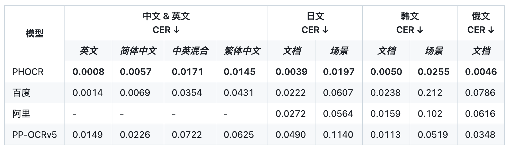

> 该文章主要评测PHOCRv1的中文识别模型效果。

<!-- more -->

### 引言

> PHOCR 是一个高性能的开源光学字符识别（OCR）工具包，专为多语种文本识别任务设计，支持包括中文、日文、韩文、俄文、越南文和泰文在内的多种语言。PHOCR 搭载了我们完全自研的识别模型 PH-OCRv1，在准确率上显著优于现有解决方案。
>
> -- [PHOCR](https://github.com/puhuilab/phocr/tree/main)

最近，有个社区小伙伴新建立了一个PHOCR，里面的文本识别模型据说效果超越PP-OCRv5:



至于真实效果如何呢？还需要自己来看一下。

### 以下代码运行环境

- OS: macOS Sequoia 15.6
- Python: 3.10.14
- phocr: 1.0.3
- datasets
- text_rec_metric

### 评测

!!! warning

    由于评测数据集的限制，以下评测结果不完全代表模型能力，支持给出一个基本参考。小伙伴们还需要在自己场景下真实评测来看哈。

该部分主要使用[TextRecMetric](https://github.com/SWHL/TextRecMetric)和测试集[text_rec_test_dataset](https://huggingface.co/datasets/SWHL/text_rec_test_dataset)来评测。

#### 测试集结果识别

```python linenums="1"
import time

import cv2
import numpy as np
from datasets import load_dataset
from tqdm import tqdm

from phocr import PHOCR, LangRec

engine = PHOCR(params={"Rec.lang_type": LangRec.CH})

dataset = load_dataset("SWHL/text_rec_test_dataset")
test_data = dataset["test"]

content = []
for i, one_data in enumerate(tqdm(test_data)):
    img = np.array(one_data.get("image"))
    img = cv2.cvtColor(img, cv2.COLOR_RGB2BGR)

    t0 = time.perf_counter()
    result = engine(img, use_rec=True, use_cls=False, use_det=False)
    elapse = time.perf_counter() - t0

    rec_text = result.txts[0]
    if len(rec_text) <= 0:
        rec_text = ""
        elapse = 0

    gt = one_data.get("label", None)
    content.append(f"{rec_text}\t{gt}\t{elapse}")

with open("pred.txt", "w", encoding="utf-8") as f:
    for v in content:
        f.write(f"{v}\n")
```

#### 计算评测指标

```python linenums="1"
from text_rec_metric import TextRecMetric

metric = TextRecMetric()

pred_path = "pred.txt"
metric = metric(pred_path)
print(metric)
```

```json
{'ExactMatch': 0.6452, 'CharMatch': 0.7648, 'avg_elapse': 0.0613}
```

### 结论

|                模型      |              模型大小  |    Exact Match   |   Char Match     |Speed(s/img)  |
| :----- | :-----| :-------: | :--- | :--|
|PHOCR v1.0.3|       224M        |      0.6452      |     0.7648  |  0.0613 |
|ch_PP-OCRv5_rec_infer.onnx |       16M        |      0.7355      |     0.9177  |  0.0713 |
|ch_PP-OCRv5_rec_server_infer.onnx |       81M        |      0.8129      |     0.9431  |  0.1133 |

上面结果和PP-OCRv5比较来看，差距还是不小的。可能是测试集的不同，导致指标差距明显。但是速度的确快一些。⚠️注意：仅供参考哈。

RapidOCR这里暂时不做集成，后续会持续关注PHOCR这里。

完整的评测结果比较：[文本识别模型比较](./model_summary.md#文本识别模型)
