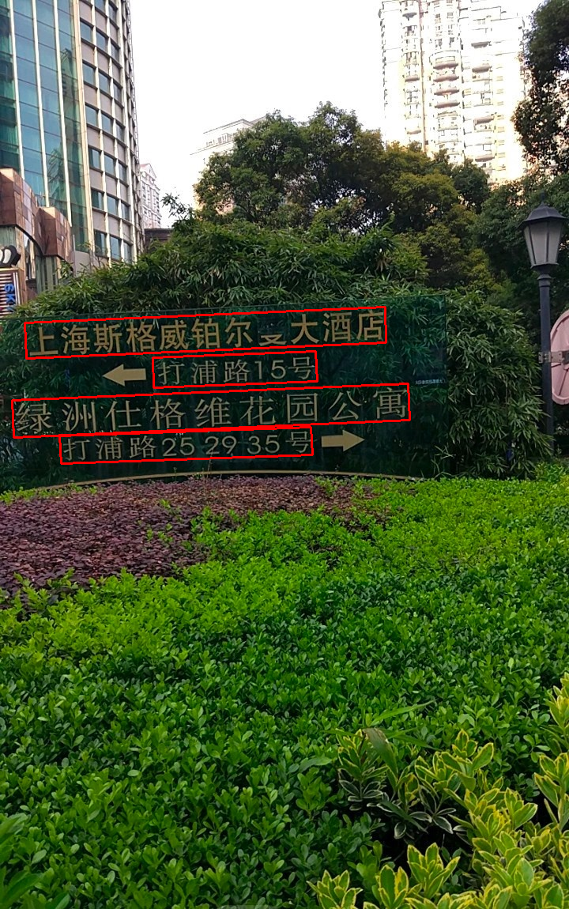
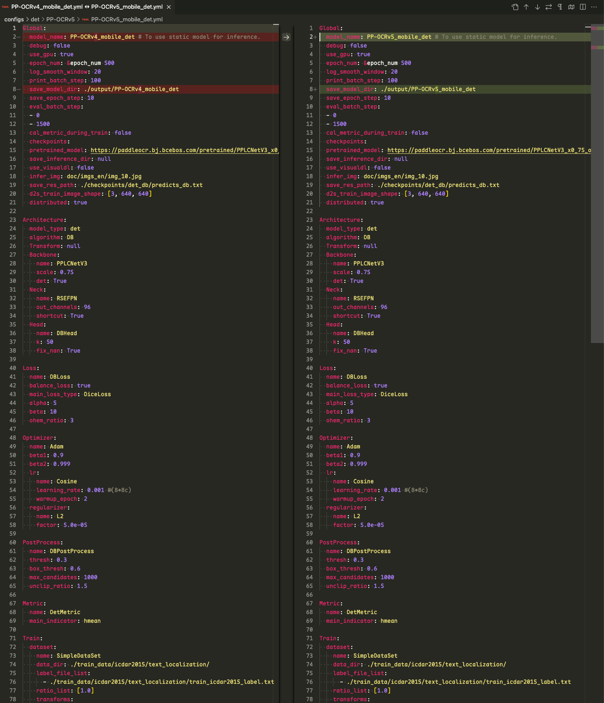
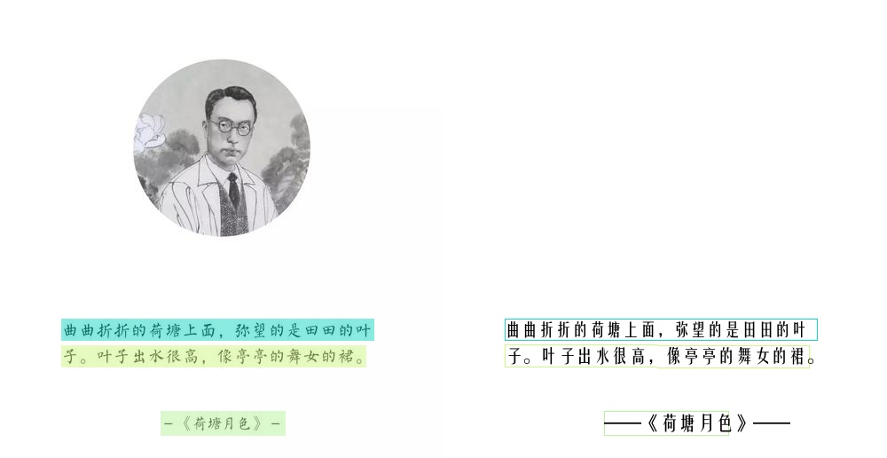
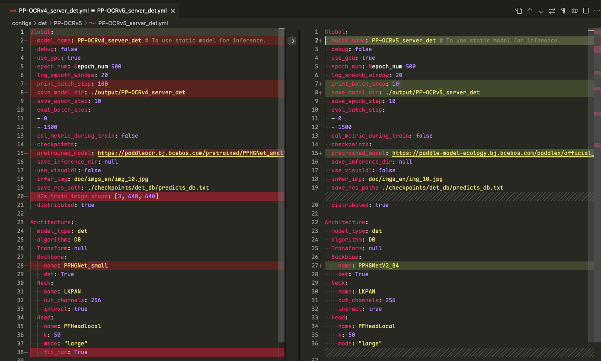
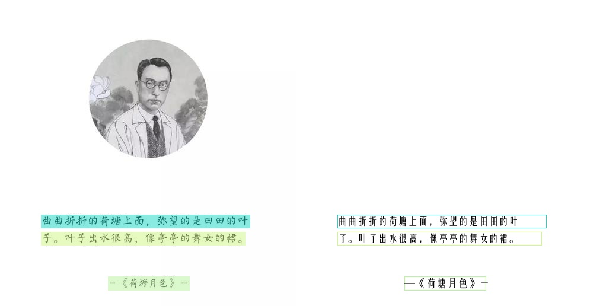

<!-- more -->

### 引言

来自 PaddleOCR[官方文档](https://www.paddleocr.ai/latest/version3.x/algorithm/PP-OCRv6/PP-OCRv6.html)：

> PP-OCRv6 是 PP-OCR 最新一代通用文字识别解决方案。PP-OCRv6 基于全新设计的 PPLCNetV4 统一骨干网络，提供 tiny, small, medium 三档模型，分别面向端侧 /IoT、移动端 / 桌面端、服务端场景。PP-OCRv6 在语言覆盖方面实现重大突破，medium/small 档单一模型统一支持简体中文、繁体中文、英文、日文及 46 种拉丁语系语言共 50 种语言（tiny 档支持 49 种，不含日文）。在内部多场景综合评估集上，PP-OCRv6_medium 相比 PP-OCRv5_server 识别精度提升 5.1%、检测精度提升 4.6%，同时 GPU 推理速度提升 2.37×；以仅 34.5M 参数的规模，精度超越 Qwen3-VL-235B, GPT-5.5 等大型视觉语言模型。

官方模型托管地址：https://www.modelscope.cn/collections/PaddlePaddle/PP-OCRv6

### 以下代码运行环境

- OS: macOS Tahoe 26.5.1
- Python: 3.10.14
- PaddlePaddle: 3.1.0
- paddle2onnx: 2.1.0
- paddlex: 3.7.0
- rapidocr: 3.8.4

### 1. 模型跑通

该步骤主要先基于 PaddleX 可以正确使用 PP-OCRv6_medium_det 模型得到正确结果。

该部分主要参考文档：[docs](https://paddlepaddle.github.io/PaddleX/latest/module_usage/tutorials/ocr_modules/text_detection.html)

安装 `paddlex`:

```bash linenums="1"
pip install "paddlex[ocr]==3.7.1"
```

测试 PP-OCRv6_medium_det 模型能否正常识别：

!!! tip

    运行以下代码时，模型会自动下载到 **/Users/用户名/.paddlex/official_models** 下。

测试图：[link](https://paddle-model-ecology.bj.bcebos.com/paddlex/imgs/demo_image/general_ocr_001.png)

```python linenums="1"
from paddlex import create_model

# medium
model = create_model(model_name="PP-OCRv6_medium_det")

# small
model = create_model(model_name="PP-OCRv6_small_det")

# tiny
model = create_model(model_name="PP-OCRv6_tiny_det")

output = model.predict("images/general_ocr_001.png", batch_size=1)
for res in output:
    res.print()
    res.save_to_img(save_path="./output/")
    res.save_to_json(save_path="./output/res.json")
```

预期结果如下，表明成功运行：



### 2. 模型转换

PaddlePaddle 官方提供了 ONNX 模型，但是考虑到自己训练的模型，仍然需要转换。因此这一步更多地是验证使用当前工具可以自行转换模型。

该部分主要参考文档：[docs](https://paddlepaddle.github.io/PaddleX/latest/pipeline_deploy/paddle2onnx.html?h=paddle2onnx#22)

=== "转换 PP-OCRv6_medium_det"

    PaddleX 官方集成了 paddle2onnx 的转换代码：

    ```bash linenums="1"
    paddlex --install paddle2onnx
    pip install onnx==1.17.0

    paddlex --paddle2onnx --paddle_model_dir models/official_models/PP-OCRv6_medium_det --onnx_model_dir models/PP-OCRv6_det_medium
    ```

    输出日志如下，表明转换成功：

    ```bash linenums="1"
    Input dir: models/official_models/PP-OCRv6_medium_det
    Output dir: models/PP-OCRv6_det_medium
    Paddle2ONNX conversion starting...
    /Users/xxxx/miniconda3/envs/py310/lib/python3.10/site-packages/paddle/utils/cpp_extension/extension_utils.py:715: UserWarning: No ccache found. Please be aware that recompiling all source files may be required. You can download and install ccache from: https://github.com/ccache/ccache/blob/master/doc/INSTALL.md
    warnings.warn(warning_message)
    [Paddle2ONNX] Start parsing the Paddle model file...
    [Paddle2ONNX] Use opset_version = 11 for ONNX export.
    [Paddle2ONNX] PaddlePaddle model is exported as ONNX format now.
    2026-06-17 22:13:44 [INFO]      Try to perform constant folding on the ONNX model with Polygraphy.
    [W] 'colored' module is not installed, will not use colors when logging. To enable colors, please install the 'colored' module: python3 -m pip install colored
    [I] Folding Constants | Pass 1
    [I]     Total Nodes | Original:  1268, After Folding:   597 |   671 Nodes Folded
    [I] Folding Constants | Pass 2
    [I]     Total Nodes | Original:   597, After Folding:   597 |     0 Nodes Folded
    2026-06-17 22:13:53 [INFO]      ONNX model saved in models/PP-OCRv6_det_medium/inference.onnx.
    Paddle2ONNX conversion succeeded
    Copied models/official_models/PP-OCRv6_medium_det/inference.yml to models/PP-OCRv6_det_medium/inference.yml
    Done
    ```

=== "转换 PP-OCRv6_small_det"

    PaddleX 官方集成了 paddle2onnx 的转换代码：

    ```bash linenums="1"
    paddlex --install paddle2onnx
    pip install onnx==1.17.0

    paddlex --paddle2onnx --paddle_model_dir models/official_models/PP-OCRv6_small_det --onnx_model_dir models/PP-OCRv6_det_small
    ```

    输出日志如下，表明转换成功：

    ```bash linenums="1"
    Input dir: models/official_models/PP-OCRv6_small_det
    Output dir: models/PP-OCRv6_det_small
    Paddle2ONNX conversion starting...
    /Users/xxxx/miniconda3/envs/py310/lib/python3.10/site-packages/paddle/utils/cpp_extension/extension_utils.py:715: UserWarning: No ccache found. Please be awarethat recompiling all source files may be required. You can download and install ccache from: https://github.com/ccache/ccache/blob/master/doc/INSTALL.md
    warnings.warn(warning_message)
    [Paddle2ONNX] Start parsing the Paddle model file...
    [Paddle2ONNX] Use opset_version = 11 for ONNX export.
    [Paddle2ONNX] PaddlePaddle model is exported as ONNX format now.
    2026-06-17 22:20:02 [INFO]      Try to perform constant folding on the ONNX model with Polygraphy.
    [W] 'colored' module is not installed, will not use colors when logging. To enablecolors, please install the 'colored' module: python3 -m pip install colored
    [I] Folding Constants | Pass 1
    [I]     Total Nodes | Original:   928, After Folding:   464 |   464 Nodes Folded
    [I] Folding Constants | Pass 2
    [I]     Total Nodes | Original:   464, After Folding:   464 |     0 Nodes Folded
    2026-06-17 22:20:11 [INFO]      ONNX model saved in models/PP-OCRv6_det_small/inference.onnx.
    Paddle2ONNX conversion succeeded
    Copied models/official_models/PP-OCRv6_small_det/inference.yml to models/PP-OCRv6_det_small/inference.yml
    Done
    ```

=== "转换 PP-OCRv6_tiny_det"

    PaddleX 官方集成了 paddle2onnx 的转换代码：

    ```bash linenums="1"
    paddlex --install paddle2onnx
    pip install onnx==1.17.0

    paddlex --paddle2onnx --paddle_model_dir models/official_models/PP-OCRv6_tiny_det --onnx_model_dir models/PP-OCRv6_det_tiny
    ```

    输出日志如下，表明转换成功：

    ```bash linenums="1"
    Input dir: models/official_models/PP-OCRv6_tiny_det
    Output dir: models/PP-OCRv6_det_tiny
    Paddle2ONNX conversion starting...
    /Users/xxxx/miniconda3/envs/py310/lib/python3.10/site-packages/paddle/utils/cpp_extension/extension_utils.py:715: UserWarning: No ccache found. Please be aware that recompiling all source files may be required. You can download and install ccache from: https://github.com/ccache/ccache/blob/master/doc/INSTALL.md
    warnings.warn(warning_message)
    [Paddle2ONNX] Start parsing the Paddle model file...
    [Paddle2ONNX] Use opset_version = 11 for ONNX export.
    [Paddle2ONNX] PaddlePaddle model is exported as ONNX format now.
    2026-06-17 22:21:03 [INFO]      Try to perform constant folding on the ONNX model with Polygraphy.
    [W] 'colored' module is not installed, will not use colors when logging. To enable colors, please install the 'colored' module: python3 -m pip install colored
    [I] Folding Constants | Pass 1
    [I]     Total Nodes | Original:   928, After Folding:   464 |   464 Nodes Folded
    [I] Folding Constants | Pass 2
    [I]     Total Nodes | Original:   464, After Folding:   464 |     0 Nodes Folded
    2026-06-17 22:21:11 [INFO]      ONNX model saved in models/PP-OCRv6_det_tiny/inference.onnx.
    Paddle2ONNX conversion succeeded
    Copied models/official_models/PP-OCRv6_tiny_det/inference.yml to models/PP-OCRv6_det_tiny/inference.yml
    Done
    ```

### 3. 模型推理验证

=== "验证 PP-OCRv6_medium_det 模型"

    该部分主要是在 RapidOCR 项目中测试能否直接使用 onnx 模型。要点主要是确定模型前后处理是否兼容。从 PaddleOCR config 文件中比较 [PP-OCRv4](https://github.com/PaddlePaddle/PaddleOCR/blob/549d83a88b7c75144120e6ec03de80d3eb9e48a5/configs/det/PP-OCRv4/PP-OCRv4_mobile_det.yml) 和 [PP-OCRv5 mobile det](https://github.com/PaddlePaddle/PaddleOCR/blob/549d83a88b7c75144120e6ec03de80d3eb9e48a5/configs/det/PP-OCRv5/PP-OCRv5_mobile_det.yml) 文件差异：

    

    从上图中可以看出，配置基本一模一样，因此现有 `rapidocr` 前后推理代码可以直接使用。

    ```python linenums="1"
    from rapidocr import RapidOCR

    model_path = "models/PP-OCRv5_mobile_det/inference.onnx"
    engine = RapidOCR(params={"Det.model_path": model_path})

    img_url = "https://img1.baidu.com/it/u=3619974146,1266987475&fm=253&fmt=auto&app=138&f=JPEG?w=500&h=516"
    result = engine(img_url)
    print(result)

    result.vis("vis_result.jpg")
    ```

    

=== "验证 PP-OCRv5_server_det 模型"

    该部分主要是在 RapidOCR 项目中测试能否直接使用 onnx 模型。要点主要是确定模型前后处理是否兼容。从 PaddleOCR config 文件中比较 [PP-OCRv4_server_det](https://github.com/PaddlePaddle/PaddleOCR/blob/b0b31c38aef135617a98fbf89c92efd8b2eebd73/configs/det/PP-OCRv4/PP-OCRv4_server_det.yml) 和 [PP-OCRv5_server_det](https://github.com/PaddlePaddle/PaddleOCR/blob/b0b31c38aef135617a98fbf89c92efd8b2eebd73/configs/det/PP-OCRv5/PP-OCRv5_server_det.yml) 文件差异：

    

    从上图中可以看出，配置基本一模一样，backbone 换了，但是前后处理配置是一样的。因此现有 `rapidocr` 前后推理代码可以直接使用。

    ```python linenums="1"
    from rapidocr import RapidOCR

    model_path = "models/PP-OCRv5_server_det/inference.onnx"
    engine = RapidOCR(params={"Det.model_path": model_path})

    img_url = "https://img1.baidu.com/it/u=3619974146,1266987475&fm=253&fmt=auto&app=138&f=JPEG?w=500&h=516"
    result = engine(img_url)
    print(result)

    result.vis("vis_result.jpg")
    ```

    

### 4. 模型精度测试

!!! warning

    测试集 [text_det_test_dataset](https://huggingface.co/datasets/SWHL/text_det_test_dataset) 包括卡证类、文档类和自然场景三大类。其中卡证类有 82 张，文档类有 75 张，自然场景类有 55 张。缺少手写体、繁体、日文、古籍文本、拼音、艺术字等数据。因此，该基于该测评集的结果仅供参考。

    欢迎有兴趣的小伙伴，可以和我们一起共建更加全面的测评集。

该部分主要使用 [TextDetMetric](https://github.com/SWHL/TextDetMetric) 和测试集 [text_det_test_dataset](https://huggingface.co/datasets/SWHL/text_det_test_dataset) 来评测。

⚠️注意：以下代码基于 `rapidocr==3.0.0` 版本测试

相关测试步骤请参见 [TextDetMetric](https://github.com/SWHL/TextRecMetric) 的 README，一步一步来就行。其中，计算 **pred.txt** 代码如下：

=== "(Exp1) PaddleX 框架+Paddle 格式模型"

    ```python linenums="1" hl_lines="9"
    import time
    import cv2
    import numpy as np
    from datasets import load_dataset
    from tqdm import tqdm

    from paddlex import create_model

    model = create_model(model_name="PP-OCRv5_mobile_det")

    dataset = load_dataset("SWHL/text_det_test_dataset")
    test_data = dataset["test"]

    content = []
    for i, one_data in enumerate(tqdm(test_data)):
        img = np.array(one_data.get("image"))
        img = cv2.cvtColor(img, cv2.COLOR_RGB2BGR)

        t0 = time.perf_counter()
        ocr_results = next(model.predict(input=img, batch_size=1))
        dt_boxes = ocr_results["dt_polys"].tolist()

        elapse = time.perf_counter() - t0

        gt_boxes = [v["points"] for v in one_data["shapes"]]
        content.append(f"{dt_boxes}\t{gt_boxes}\t{elapse}")

    with open("pred.txt", "w", encoding="utf-8") as f:
        for v in content:
            f.write(f"{v}\n")
    ```

=== "(Exp2)RapidOCR 框架+Paddle 格式模型"

    ```python linenums="1" hl_lines="11"
    import cv2
    import numpy as np
    from datasets import load_dataset
    from tqdm import tqdm

    from rapidocr import EngineType, ModelType, OCRVersion, RapidOCR

    engine = RapidOCR(
        params={
            "Det.ocr_version": OCRVersion.PPOCRV5,
            "Det.engine_type": EngineType.PADDLE,
            "Det.model_type": ModelType.MOBILE,
        }
    )

    dataset = load_dataset("SWHL/text_det_test_dataset")
    test_data = dataset["test"]

    content = []
    for i, one_data in enumerate(tqdm(test_data)):
        img = np.array(one_data.get("image"))
        img = cv2.cvtColor(img, cv2.COLOR_RGB2BGR)

        ocr_results = engine(img, use_det=True, use_cls=False, use_rec=False)
        dt_boxes = ocr_results.boxes

        dt_boxes = [] if dt_boxes is None else dt_boxes.tolist()
        elapse = ocr_results.elapse

        gt_boxes = [v["points"] for v in one_data["shapes"]]
        content.append(f"{dt_boxes}\t{gt_boxes}\t{elapse}")

    with open("pred.txt", "w", encoding="utf-8") as f:
        for v in content:
            f.write(f"{v}\n")
    ```

=== "(Exp3)RapidOCR 框架+ONNX Runtime 格式模型"

    ```python linenums="1" hl_lines="11"
    import cv2
    import numpy as np
    from datasets import load_dataset
    from tqdm import tqdm

    from rapidocr import EngineType, ModelType, OCRVersion, RapidOCR

    engine = RapidOCR(
        params={
            "Det.ocr_version": OCRVersion.PPOCRV5,
            "Det.engine_type": EngineType.ONNXRUNTIME,
            "Det.model_type": ModelType.MOBILE,
        }
    )

    dataset = load_dataset("SWHL/text_det_test_dataset")
    test_data = dataset["test"]

    content = []
    for i, one_data in enumerate(tqdm(test_data)):
        img = np.array(one_data.get("image"))
        img = cv2.cvtColor(img, cv2.COLOR_RGB2BGR)

        ocr_results = engine(img, use_det=True, use_cls=False, use_rec=False)
        dt_boxes = ocr_results.boxes

        dt_boxes = [] if dt_boxes is None else dt_boxes.tolist()
        elapse = ocr_results.elapse

        gt_boxes = [v["points"] for v in one_data["shapes"]]
        content.append(f"{dt_boxes}\t{gt_boxes}\t{elapse}")

    with open("pred.txt", "w", encoding="utf-8") as f:
        for v in content:
            f.write(f"{v}\n")
    ```

计算指标代码：

```python linenums="1"
from text_det_metric import TextDetMetric

metric = TextDetMetric()
pred_path = "pred.txt"
metric = metric(pred_path)
print(metric)
```

指标汇总如下（以下指标均为 CPU 下计算所得）：

|Exp|模型|推理框架|模型格式|Precision↑|Recall↑|H-mean↑|Elapse↓|
|:---:|:---|:---|:---|:---:|:---:|:---:|:---:|
|1|PP-OCRv5_mobile_det|PaddleX |PaddlePaddle|0.7864|0.8018|0.7940|0.1956|
|2|PP-OCRv5_mobile_det|RapidOCR| PaddlePaddle|0.7861|0.8266|0.8058|0.5328|
|3|PP-OCRv5_mobile_det|RapidOCR| ONNX Runtime|0.7861|0.8266|0.8058|0.1653|
|10|PP-OCRv5_mobile_det|RapidOCR| PyTorch|0.7861|0.8266|0.8058|0.8861|
|4|PP-OCRv4_mobile_det|RapidOCR |ONNX Runtime|0.8301|0.8659|0.8476|-|
|||||||||
|5|PP-OCRv5_server_det|PaddleX |PaddlePaddle|0.8347|0.8583|0.8463|2.1450|
|6|PP-OCRv5_server_det|RapidOCR |PaddlePaddle|||||
|7|PP-OCRv5_server_det|RapidOCR| ONNX Runtime|0.7394|0.8442|0.7883|2.0628|
|8|PP-OCRv4_server_det|RapidOCR |ONNX Runtime|0.7922|0.8128|0.7691|-|
|9|PP-OCRv4_server_det|RapidOCR |PyTorch|0.7394|0.8442|0.7883|5.9122|

从以上结果来看，可以得到以下结论：

1. Exp1 和 Exp2 相比，H-mean 差异不大，说明文本检测 **前后处理代码可以共用**。
2. Exp2 和 Exp3 相比，mobile 模型转换为 ONNX 格式后，指标几乎一致，说明 **模型转换前后，误差较小，推理速度也有提升**。
3. Exp3 和 Exp4 相比，mobile 整体指标弱于 PP-OCRv4 的。因为测评集集中在中英文的印刷体，手写体少些，因此仅供参考。
4. Exp6 直接跑，会报以下错误，暂时没有找到原因。如有知道的小伙伴，欢迎留言告知。

    ```bash linenums="1"
    5%|████████▏                                                                                                                                                     | 11/212 [00:42<13:11,  3.94s/it][1]    61275 bus error  python t.py

    /Users/xxxxx/miniconda3/envs/py310/lib/python3.10/multiprocessing/resource_tracker.py:224: UserWarning: resource_tracker: There appear to be 1 leaked semaphore objects to clean up at shutdown
    warnings.warn('resource_tracker: There appear to be %d '
    ```

5. 因为 Exp6 暂时没有找到原因，粗略将 Exp5 和 Exp7 相比，可以看到 PP-OCRv5 server 模型转换为 ONNX 格式后，**H-mean下降了5.8%**，但是转换方式和 mobile 的相同，具体原因需要进一步排查。如有知道的小伙伴，欢迎留言告知。
6. Exp7 和 Exp8 相比，PP-OCRv5 server 模型提升很大（H-mean 提升 7.72%）。当然，不排除训练用到了测评集数据。
7. Exp10 为新增的 PyTorch 模型，其精度与 Paddle 模型几乎一致，但推理速度稍微有些下降。

!!! tip

    - 如果是单一中英文场景，建议用 PP-OCRv4 系列
    - 如果是中英日、印刷和手写体混合场景，建议用 PP-OCRv5 系列

上述表格中基于 ONNX Runtime 的结果已经更新到 [开源 OCR 模型对比](./model_summary.md) 中。

### 5. 集成到 rapidocr 中

该部分主要包括将托管模型到魔搭、更改 rapidocr 代码适配等。

#### 托管模型到魔搭

该部分主要是涉及模型上传到对应位置，并合理命名。注意上传完成后，需要打 Tag，避免后续 rapidocr whl 包中找不到模型下载路径。

我这里已经上传到了魔搭上，详细链接参见：[link](https://www.modelscope.cn/models/RapidAI/RapidOCR/files)

#### 更改 rapidocr 代码适配

该部分主要涉及到更改 [default_models.yaml](https://github.com/RapidAI/RapidOCR/blob/4d35ed272a1192afbcb95e823d99eb14c86b7893/python/rapidocr/default_models.yaml) 和 [paddle.py](https://github.com/RapidAI/RapidOCR/blob/4d35ed272a1192afbcb95e823d99eb14c86b7893/python/rapidocr/inference_engine/paddle.py) 的代码来适配。

同时，需要添加对应的单元测试，在保证之前单测成功的同时，新的针对性该模型的单测也能通过。

我这里已经做完了，小伙伴们感兴趣可以去看看源码。

### 写在最后

至此，该部分集成工作就基本完成了。这部分代码会集成到 `rapidocr==3.0.0` 中。

版本号之所以从 v2.1.0 到 v3.0.0，原因是：语义化版本号。我在集成过程中，发现 v2.1.0 中字段不太合理，做了一些改进，动了外部 API，因此只能升大版本号。请大家在使用过程中，注意查看最新文档→ [docs](https://rapidai.github.io/RapidOCRDocs/main/install_usage/rapidocr/usage/)。
