RapidOCR在12款开源OCR中表现优异

<!-- more -->

前几天，Joker告诉我看到一篇OCR测评的文章，并说咱家RapidOCR整体表现很不错。我特地去看了一下，发现是广州软件院发起的OCR测评，算是一个比较公允的测评方了。这篇文章是今年6月份写的，也不算太老，还是有一点参考意义的。

RapidOCR在12款开源OCR中也算得上可圈可点了。完整的测评报告，请移步 [AI测评 | 十二款开源OCR开箱测评，文字识别哪家强](https://mp.weixin.qq.com/s?__biz=MzA5MjU2NjYxNQ==&mid=2449494038&idx=1&sn=f144be7182839e22a421e0df9e9609f0&scene=21#wechat_redirect) 获取。因为测评的文章没有开启原创，不能转载，因此就在这里给出了链接，在此感谢广州软件院的测评工作，为大家选择合适的OCR模型提供了参考。

⚠️注意：下面的图文均是摘自[AI测评 | 十二款开源OCR开箱测评，文字识别哪家强](https://mp.weixin.qq.com/s?__biz=MzA5MjU2NjYxNQ==&mid=2449494038&idx=1&sn=f144be7182839e22a421e0df9e9609f0&scene=21#wechat_redirect) 中，如有侵权，请告知我删除。

我在这里只放一些关键的测评结论：
 (1)印刷中文的综合测评结果为：

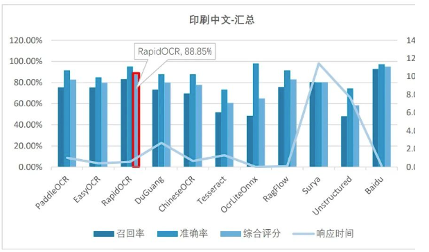

（2）印刷英文的综合测评结果为：

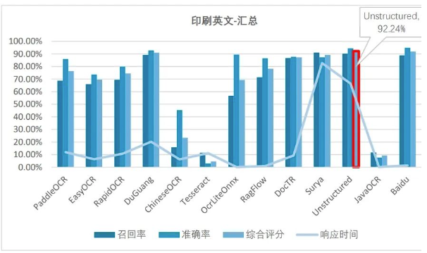

（3）变形字体的艺术字测评结果为：

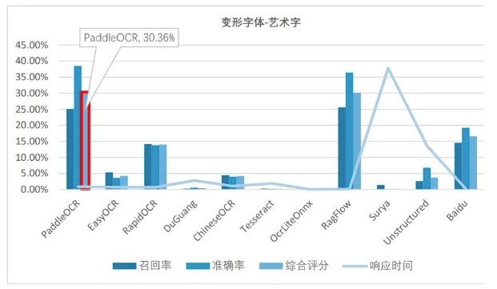

（4）自然场景的街景图片测评结果为：

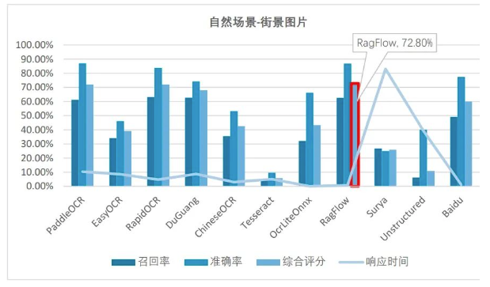

（5）手写中文的综合测评结果为：

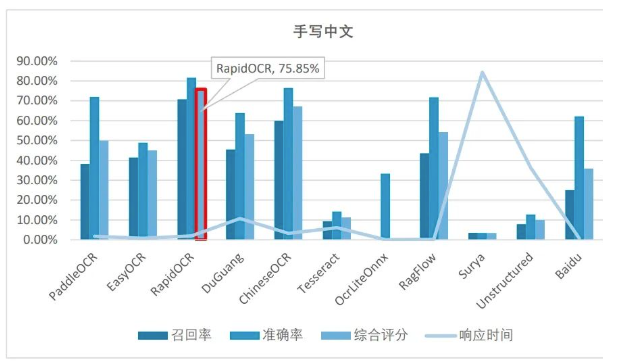

测评总结：

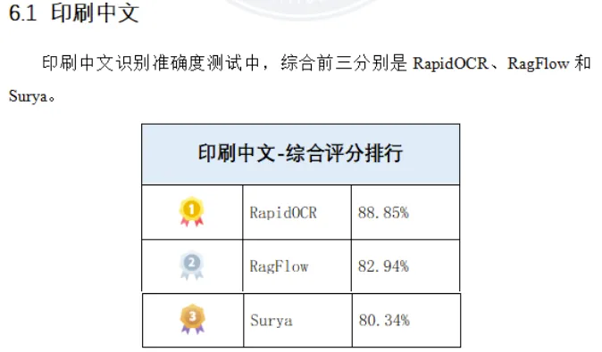

**RapidOCR虽然基于PaddleOCR，但做了⼀定预处理和参数优化，因此在⾓度旋转180度和低对⽐度两个数据集中拉开了与PaddleOCR的差距；并且基于onnx推理格式的版本，在识别的速度上也较PaddleOCR有明显提升。**各个⼯具在中⽂印刷⽂字正常扫描、拍照图⽚中识别的准确度都很⾼。其中，扫描⽂档数据集，前三名的綜合评分都在99%以上，照⽚⽂档数据集中，前三名的综合评分都在98%以上。

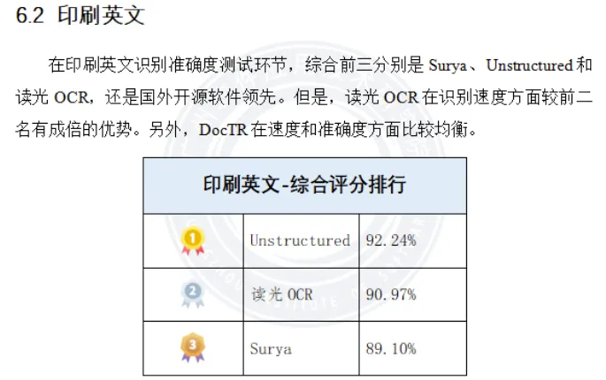

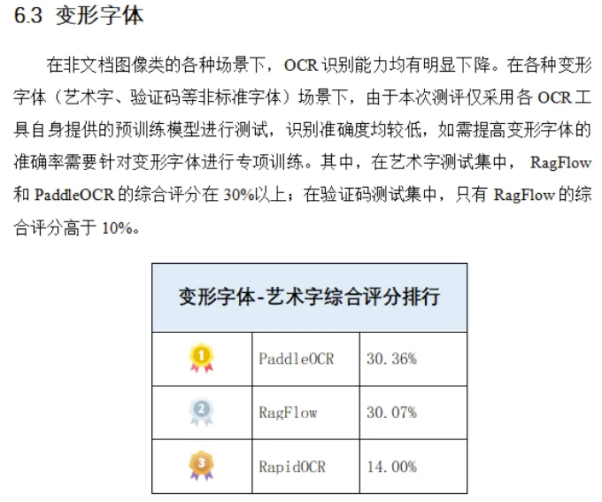

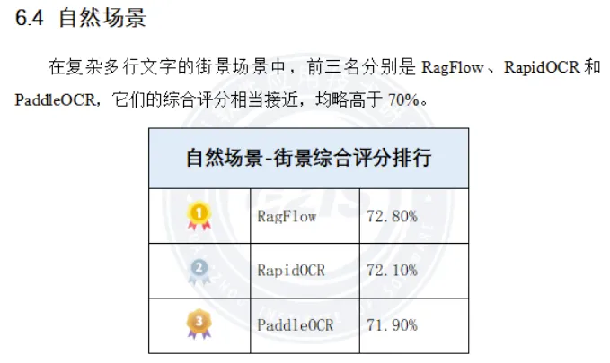

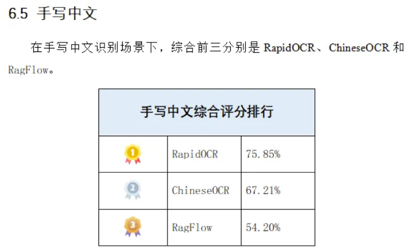

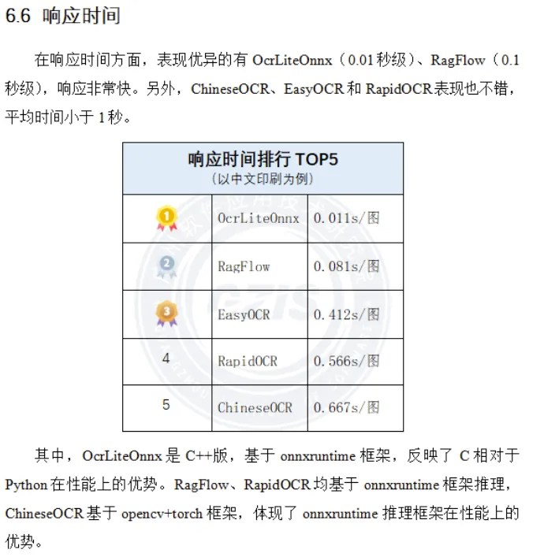

完整测评报告：<https://pan.baidu.com/s/1DgFZfKw5PxQuyy1PIX8thg?pwd=0527>
