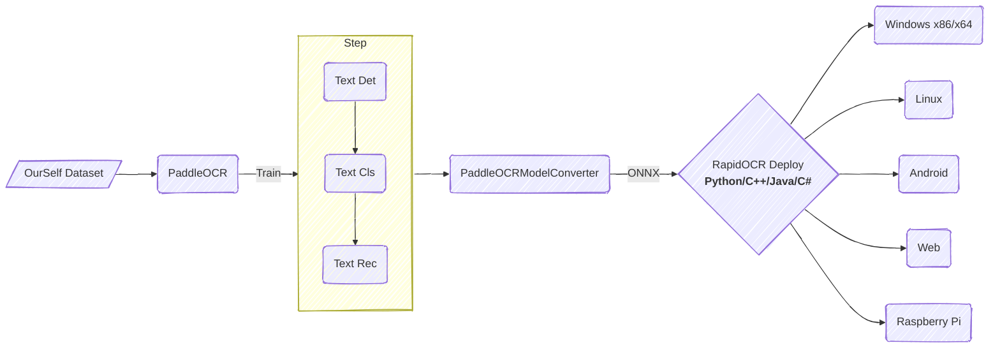

<div align="center">
  
  <div>&nbsp;</div>
  <b><font size="4"><i> Open source OCR for the security of the digital world </i></font></b>
  <div>&nbsp;</div>

  <div style="display: flex; flex-wrap: wrap; justify-content: center; gap: 0.5rem; align-items: center;">
    <a href="https://clawhub.ai/rapidai/rapidocr" target="_blank"></a>
    <a href="https://huggingface.co/spaces/RapidAI/RapidOCRv3" target="_blank"></a>
    <a href="https://www.modelscope.cn/studios/RapidAI/RapidOCRv3.0.0/summary" target="_blank"></a>
    <a href="https://colab.research.google.com/github/RapidAI/RapidOCR/blob/main/assets/RapidOCRDemo.ipynb" target="_blank"></a>
    <a href="">=3.8-aff.svg"></a>
    <a href=""></a>
    <a href="https://github.com/RapidAI/RapidOCR/graphs/contributors"></a>
    <a href="https://pepy.tech/project/rapidocr"></a>
    <a href="https://pypi.org/project/rapidocr/"></a>
    <a href="https://github.com/RapidAI/RapidOCR/stargazers"></a>
    <a href="https://semver.org/"></a>
    <a href="https://github.com/psf/black"></a>
  </div>
</div>

### 📝 Introduction

RapidOCR is a completely open-source, free OCR tool that supports multi-platform, multi-language operation and rapid offline deployment. Its core advantages lie in extreme speed and extensive compatibility.

**Supported Languages:** Default support for Chinese and English recognition. For other supported languages, please refer to the documentation: [Model List](model_list.md)

**Project Origin:** Considering that [PaddleOCR](https://github.com/PaddlePaddle/PaddleOCR) still has room for optimization in engineering aspects, we innovatively converted the models in PaddleOCR into the highly compatible ONNX format to simplify and accelerate the inference deployment of OCR models on various terminal devices. Furthermore, we achieved seamless cross-platform porting based on multiple programming languages such as Python, C++, Java, and C#, enabling developers to get started easily and integrate efficiently.

**Name Implication:** The name "RapidOCR" embodies our core expectations for the product: **Rapid** (simple operation, fast response), **Good & Economical** (low resource consumption, high cost-effectiveness), and **Intelligent** (achieving accurate and efficient recognition relying on deep learning technology). We focus on leveraging the advantages of artificial intelligence to create compact yet powerful models, relentlessly pursuing speed while ensuring excellent recognition results.

**User Guide:**

- **Direct Deployment:** If the models provided in this repository meet your needs, simply refer to the [Quick Start](quickstart.md) guide to quickly complete the deployment and usage of RapidOCR.
- **Custom Fine-tuning:** If the existing models cannot meet specific scenario requirements, you can fine-tune them using your own data based on PaddleOCR, and then apply the optimized models to the RapidOCR deployment process to achieve personalized customization.

If you find this project helpful for your work or study, we kindly ask you to give us a ⭐ Star to provide valuable support and encouragement!

### Overall Framework



### 🎥 Visualization

<div align="center">
    
</div>

### 👥 Who uses RapidOCR? ([more](https://github.com/RapidAI/RapidOCR/discussions/286))

- [Docling](https://github.com/docling-project/docling)
- [CnOCR](https://github.com/breezedeus/CnOCR)
- [api-for-open-llm](https://github.com/xusenlinzy/api-for-open-llm)
- [arknights-mower](https://github.com/ArkMowers/arknights-mower)
- [pensieve](https://github.com/arkohut/pensieve)
- [genshin_artifact_auxiliary](https://github.com/SkeathyTomas/genshin_artifact_auxiliary)
- [ChatLLM](https://github.com/yuanjie-ai/ChatLLM)
- [langchain](https://github.com/langchain-ai/langchain)
- [Langchain-Chatchat](https://github.com/chatchat-space/Langchain-Chatchat)
- [JamAIBase](https://github.com/EmbeddedLLM/JamAIBase)
- [PAI-RAG](https://github.com/aigc-apps/PAI-RAG)
- [ChatAgent_RAG](https://github.com/junyuyang7/ChatAgent_RAG)
- [OpenAdapt](https://github.com/OpenAdaptAI/OpenAdapt)
- [Umi-OCR](https://github.com/hiroi-sora/Umi-OCR)

> For more projects that use RapidOCR, you are welcome to register at the [registration address](https://github.com/RapidAI/RapidOCR/discussions/286). Registration is solely for product promotion.

### 🎖 Contributors

<p align="left">
  <a href="https://github.com/RapidAI/RapidOCR/graphs/contributors">
    
  </a>
</p>

### 📜 Citation

If you find this project useful in your research, please consider cite:

```bibtex
@misc{RapidOCR 2021,
    title={{Rapid OCR}: OCR Toolbox},
    author={RapidAI Team},
    howpublished = {\url{https://github.com/RapidAI/RapidOCR}},
    year={2021}
}
```

### ⭐️ Star history


### ⚖️ License

The copyright of the OCR model is held by Baidu, while the copyrights of all other engineering scripts are retained by the repository's owner.

This project is released under the [Apache 2.0 license](https://github.com/RapidAI/RapidOCR/blob/90024f8d2290c484b56f617bbae6c9f98f04f7a4/LICENSE).
