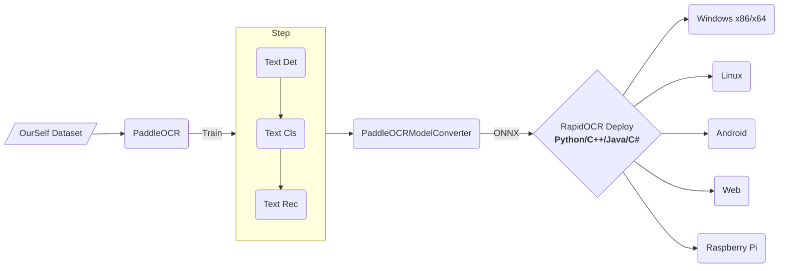

<div align="center">
  

<div align="center">
    <b><font size="4"><i>信创级开源OCR - 为世界内容安全贡献力量</i></font></b>
</div>
<div>&nbsp;</div>

<a href="https://huggingface.co/spaces/RapidAI/RapidOCRv3" target="_blank"></a>
<a href="https://www.modelscope.cn/studios/RapidAI/RapidOCRv3.0.0/summary" target="_blank"></a>
<a href="https://colab.research.google.com/github/RapidAI/RapidOCR/blob/main/assets/RapidOCRDemo.ipynb" target="_blank"></a>
<a href="">=3.6-aff.svg"></a>
<a href=""></a>
<a href="https://github.com/RapidAI/RapidOCR/graphs/contributors"></a>
<a href="https://pypistats.org/packages/rapidocr"></a>
<a href="https://pypistats.org/packages/rapidocr_onnxruntime"></a>
<a href="https://pypistats.org/packages/rapidocr_openvino"></a>
<a href="https://pypistats.org/packages/rapidocr_paddle"></a>
<a href="https://pypi.org/project/rapidocr/"></a>
<a href="https://github.com/RapidAI/RapidOCR/stargazers"></a>
<a href="https://semver.org/"></a>
<a href="https://github.com/psf/black"></a>

</div>

### 📝 简介

RapidOCR 是一款完全开源免费、支持离线快速部署的多平台多语言 OCR 工具，以极致的速度与广泛的兼容性为核心优势。

**支持语言：** 默认支持中英文识别。其他支持的语言，参见文档：[模型列表](https://rapidai.github.io/RapidOCRDocs/main/model_list/)

**项目缘起：** 鉴于 [PaddleOCR](https://github.com/PaddlePaddle/PaddleOCR) 在工程化方面仍有优化空间，为简化并加速 OCR 模型在各类终端设备上的推理部署，我们创新性地将 PaddleOCR 中的模型转换为高度兼容的 ONNX 格式，并基于 Python、C++、Java、C# 等多种编程语言，实现了跨平台的无缝移植，让开发者能够轻松上手、高效集成。

**名称寓意：** RapidOCR 这一名称承载着我们对产品的核心期待——轻快（操作简便、响应迅速）、好省（资源占用低、成本效益高）且智能（依托深度学习技术，实现精准高效的识别）。我们专注于发挥人工智能的优势，打造小巧而强大的模型，始终将速度作为不懈追求，同时确保卓越的识别效果。

**使用指南：**

- **直接部署**：若本仓库提供的模型已满足您的需求，只需参考 [快速开始](https://rapidai.github.io/RapidOCRDocs/main/quickstart/) 即可快速完成 RapidOCR 的部署与使用。
- **定制化微调**：若现有模型无法满足特定场景需求，您可在 PaddleOCR 基础上，利用自有数据进行微调，再将优化后的模型应用于 RapidOCR 的部署流程，实现个性化定制。

如果您觉得本项目对您的工作或学习有所帮助，恳请您不吝赐予一颗 ⭐ Star，给予我们宝贵的支持与鼓励！

### 整体框架



### 🎥 效果展示

<div align="center">
    
</div>

### 👥 谁在使用？([更多](https://github.com/RapidAI/RapidOCR/discussions/286))

- [Docling](https://github.com/docling-project/docling)
- [CnOCR](https://github.com/breezedeus/CnOCR)
- [api-for-open-llm](https://github.com/xusenlinzy/api-for-open-llm)
- [arknights-mower](https://github.com/ArkMowers/arknights-mower)
- [pensieve](https://github.com/arkohut/pensieve)
- [genshin_artifact_auxiliary](https://github.com/SkeathyTomas/genshin_artifact_auxiliary)
- [ChatLLM](https://github.com/yuanjie-ai/ChatLLM)
- [langchain](https://github.com/langchain-ai/langchain)
- [Langchain-Chatchat](https://github.com/chatchat-space/Langchain-Chatchat)
- [JamAIBase](https://github.com/EmbeddedLLM/JamAIBase)
- [PAI-RAG](https://github.com/aigc-apps/PAI-RAG)
- [ChatAgent_RAG](https://github.com/junyuyang7/ChatAgent_RAG)
- [OpenAdapt](https://github.com/OpenAdaptAI/OpenAdapt)
- [Umi-OCR](https://github.com/hiroi-sora/Umi-OCR)

> 更多使用RapidOCR的项目，欢迎在[登记地址](https://github.com/RapidAI/RapidOCR/discussions/286)登记，登记仅仅为了产品推广。

### 🎖 贡献者

<p align="left">
  <a href="https://github.com/RapidAI/RapidOCR/graphs/contributors">
    
  </a>
</p>

### 📜 引用

如果您发现该项目对您的研究有用，请考虑引用：

```bibtex
@misc{RapidOCR 2021,
    title={{Rapid OCR}: OCR Toolbox},
    author={RapidAI Team},
    howpublished = {\url{https://github.com/RapidAI/RapidOCR}},
    year={2021}
}
```

### ⭐️ Star history

[](https://starchart.cc/RapidAI/RapidOCR)

### ⚖️ 开源许可证

OCR模型版权归百度所有，其他工程代码版权归本仓库所有者所有。

该项目采用 [Apache 2.0 license](https://github.com/RapidAI/RapidOCR/blob/90024f8d2290c484b56f617bbae6c9f98f04f7a4/LICENSE) 开源许可证。
