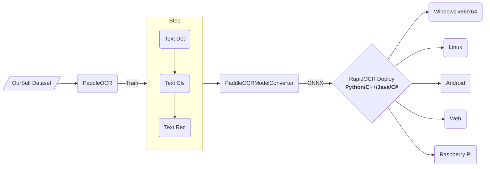

<div align="center">
  <p1icture>
    <source media="(prefers-color-scheme: dark)" srcset="https://github.com/RapidAI/RapidOCR/releases/download/v1.1.0/RapidOCR_LOGO_white.png"  width="55%" height="55%">
    <source media="(prefers-color-scheme: light)" srcset="https://raw.githubusercontent.com/RapidAI/RapidOCR/main/assets/RapidOCR_LOGO.png"  width="55%" height="55%">
    
  </picture>

<div>&nbsp;</div>
<div align="center">
    <b><font size="4"><i>信创级开源OCR - 为世界内容安全贡献力量</i></font></b>
</div>
<div>&nbsp;</div>

<a href="https://huggingface.co/spaces/SWHL/RapidOCRDemo" target="_blank"></a>
<a href="https://www.modelscope.cn/studios/liekkas/RapidOCRDemo/summary" target="_blank"></a>
<a href="https://colab.research.google.com/github/RapidAI/RapidOCR/blob/main/assets/RapidOCRDemo.ipynb" target="_blank"></a>
<a href="https://aistudio.baidu.com/aistudio/projectdetail/4444785?sUid=57084&shared=1&ts=1660896122332" target="_blank"></a><br/>
<a href="">=3.6,<3.13-aff.svg"></a>
<a href=""></a>
<a href="https://github.com/RapidAI/RapidOCR/graphs/contributors"></a>
<a href="https://pepy.tech/project/rapidocr_onnxruntime"></a>
<a href="https://pepy.tech/project/rapidocr_openvino"></a>
<a href="https://pepy.tech/project/rapidocr_paddle"></a>
<a href="https://pypi.org/project/rapidocr-onnxruntime/"></a>
<a href="https://github.com/RapidAI/RapidOCR/stargazers"></a>
<a href="https://semver.org/"></a>
<a href="https://github.com/psf/black"></a>

</div>

### 简介

💖目前已知**运行速度最快、支持最广**，完全开源免费并支持离线快速部署的多平台多语言OCR。主打ONNXRuntime推理引擎推理，比PaddlePaddle推理引擎速度有4~5倍提升，且没有内存泄露问题。

**支持语言**：默认是中英文，其他语言识别需要自助转换。具体参考[这里](https://rapidai.github.io/RapidOCRDocs/blog/2022/09/28/%E6%94%AF%E6%8C%81%E8%AF%86%E5%88%AB%E8%AF%AD%E8%A8%80/)

**缘起**：因为[PaddleOCR](https://github.com/PaddlePaddle/PaddleOCR)工程化尚有提升空间，为了方便在各种端上进行OCR推理，我们将PaddleOCR中的模型转换为ONNX格式，使用`Python/C++/Java/C#` 将它移植到各个平台，方便大家使用。

**名称来源**：轻快好省并智能。基于深度学习的OCR技术，主打人工智能优势及小模型，以速度为使命，效果为导向。

**使用**：

- 如果仓库下已有模型满足要求 → RapidOCR部署使用即可。
- 不满足要求 → 基于PaddleOCR在自己数据上微调 → RapidOCR部署。

如果该仓库有帮助到你，还请点个小星星⭐呗！

### 效果展示

<div align="center">
    
</div>

### 整体框架



### 相关产品概览图

!!! info
    下图表格中，除**测评集**部分托管在[Hugging Face](https://huggingface.co/SWHL)下，其余均在Github下，详细介绍如下：<br/>第一行是功能介绍<br/>第二行是对应的仓库名称，可直接去Github搜索该名称即可。

<div>
    
</div>

### 贡献者

<p align="left">
  <a href="https://github.com/RapidAI/RapidOCR/graphs/contributors">
    
  </a>
</p>

### 引用

如果您发现该项目对您的研究有用，请考虑引用：

```bibtex
@misc{RapidOCR 2021,
    title={{Rapid OCR}: OCR Toolbox},
    author={RapidAI Team},
    howpublished = {\url{https://github.com/RapidAI/RapidOCR}},
    year={2021}
}
```

### Star history

[](https://starchart.cc/RapidAI/RapidOCR)

### 开源许可证

OCR模型版权归百度所有，其他工程代码版权归本仓库所有者所有。

该项目采用 [Apache 2.0 license](https://github.com/RapidAI/RapidOCR/blob/90024f8d2290c484b56f617bbae6c9f98f04f7a4/LICENSE) 开源许可证。
